# Shop — Checkout + Transaction Completions (cart · auction · tickets · popcorn)

Work in `D:\Ztor. 2.0\L-2.0-EndGame`. Read the pointed-to files; don't trust this prompt over the code. **One-shot** — honour the self-gates below (prove the goods checkout end-to-end on ONE order before extending to tickets/bundle/auction/popcorn; pin the mock-payment + login-gate mechanism once and reuse it). Front-end only: **payment is mock, login is mock — never real.** The look must read **premium / luxury**, grounded in Mobbin's best ecommerce and skinned strictly with Ztor's dark + orange tokens.

Depends on: the detail pages + working cart from the Detail-Pages build, and the **global login modal** from the auth-gating build (checkout is login-gated and reuses it). If either isn't present yet, build against the documented hooks and note the dependency in HANDOFF.md.

## CONTEXT — read first (don't dump, read)
- **`BUILD-PROMPT-TEMPLATE.md`** — verified Phase 0 (tokens; generated `components.css` + `node tools/build-css.mjs`; `DS.register`; new-page head/script order; gates; mobile layer). Load it.
- `CLAUDE.md`, `AGENTS.md`, `COMPONENTS.md`, `docs/DESIGN_SYSTEM.md`.
- **Cart:** `assets/cart.js` + `assets/cart.css` (the drawer; items, qty, the checkout entry point). **Items/data:** `assets/shop-data-*.js` (now extended with the PDP fields — incl. `type:"bundle"` + `components[]`).
- **Login modal (reuse):** the global `data-auth-modal` / `DSDrawer.open('auth')` module from the auth-gating build, gated by `body[data-auth]` (`'logged-in'`/`'logged-out'`). **Checkout, bid, ticket, redeem all require login → open that modal, resume the action after mock login.**
- **Mock-payment reference:** `assets/cocreate.js` already models a Stripe-style card step + the front-end/back-end boundary — mirror its approach (card fields + validation + mocked success/fail; never a real charge).
- **Per-type surfaces to complete:** `shop-auction.html` (+ `auction-card.css`) for bids; `shop-events.html` for tickets; `shop-popcorn.html` + the popcorn pricing page for redeem/rent/top-up.

⚠ `CLAUDE.md`/`COMPONENTS.md` "what's cut" notes are stale — trust the code; verify in a browser.

## DESIGN SYSTEM RULES
Don't re-derive — in `BUILD-PROMPT-TEMPLATE.md`. New component CSS → `css/components/NN-name.css` + `@import` in `css/main.css` + rebuild; never hand-edit `components.css`/`tokens.css`; tokens only. Behaviour → `DS.register` in `ds.js`, never inline per page. Reuse `ds-drawer`, `ds-skeleton`, `glass-tabs`, `status-tag`, the cart, the auth modal, buttons. The checkout is a multi-step flow — reuse the cocreate stepper pattern where it fits; don't fork a new stepper.

## THE FOUR NON-NEGOTIABLES (verbatim — do not soften)

**[1] TOKEN & COMPONENT DISCIPLINE**
- NEVER hardcode a value (color, size, spacing, font, radius, z-index, breakpoint). Always reference a token.
- New tokens and new component CSS files ARE allowed — but ONLY after proving the design system doesn't already cover it.
- SEARCH-BEFORE-CREATE (mandatory): before any new token, search the token layer for an exact OR semantic equivalent; before any new component CSS, search existing components. Create only if none exists.
- Any new token/component MUST follow the Phase 0 layering, structure, and naming convention — no ad-hoc patterns.
- Log every new token/component + the search that confirmed it was missing, in HANDOFF.md.
- Prevent: duplicate tokens, near-duplicate components, scattered hardcoded values.

**[2] FEATURE = COMPLETE FLOW**
- A terse feature name means build the COMPLETE end-to-end user flow — not one screen.
- Decompose into every page, state, and interaction a real user needs start-to-finish. Map it as a FLOW INVENTORY.
- Every button/link resolves — no dead-ends, no orphan buttons. Include empty/loading/error/success/out-of-stock-type states.
- Front-end only: full UX with mock data + clearly-labeled backend stubs. NO real payment/auth/persistence — client-side validation + mock responses. Log every backend integration point in HANDOFF.md.
- BOUNDED: complete WITHIN the named feature — NOT expand into others. Ambiguous edges → propose the full flow, flag optional extensions for the user's call.

**[3] MOBBIN REFERENCE GATE**
- Before designing any feature flow, use Mobbin to ground flow + screen patterns in real, proven products.
- Pull the same flow from the TOP 5 ecommerce apps; synthesize the COMMON pattern (steps, screen structure, key UI, states). This drives the Flow Inventory.
- Mobbin governs STRUCTURE/FLOW/UX ONLY — it does NOT override visuals. Skin every pattern with Ztor tokens + components. Reference the pattern, not the app's colors/type/logo.
- Cite which apps were used. Synthesize, don't average into mush; don't clone any single app's look.
- Product-specific flows with no clean match (auction bid, popcorn redeem) → adapt the closest convention (ticketing / wallet top-up), don't force-fit; flag these. If Mobbin returns nothing usable → STOP and flag.

**[4] PRECEDENCE (when inputs conflict)**
1. Ztor design system (tokens/components) = visual law. Nothing overrides it.
2. Figma / screenshot / reference site (if supplied) = exact visual spec for that screen.
3. Mobbin = flow/structure/UX-pattern source (≥3 apps).
4. EverythingAbtZtor.md = product, copy, IA truth.
→ Mobbin decides the skeleton; the Ztor design system supplies the skin. Never the reverse.

## OTHER CONSTRAINTS
- Vanilla HTML/CSS/JS (ES modules). No framework/CSS-framework/jQuery. Pages run static.
- **Login-gated + mock:** checkout / place-bid / buy-ticket / redeem all require login → open the global auth modal, set `body[data-auth]='logged-in'` on mock login, resume the action. Payment = mock card (fields + validation + mock success/fail), never a real charge. Persistence (orders/bids/tickets/rentals) is mock (localStorage/in-memory) so it survives navigation in the demo.
- **Never re-ask saved info — site-wide.** The user center (用戶中心 / profile) holds a mock **address book + saved payment methods + delivery preference**. EVERY paid flow (this checkout, auction pay, ticket purchase, and the cocreate backing payment) PREFILLS from it and offers 「編輯」 instead of blank forms; inputs show only first-time or on-edit. Build this as ONE shared **saved-profile module** (read/write), NOT checkout-local — so the same prefill works across the whole site. Mock-persist it (localStorage); the 「儲存此資訊」 checkbox (default on) is what writes new details into it.
- **Premium / luxury** via Mobbin-grounded layout + Ztor tokens; no drop shadows (glass only); no new colours.
- Currency: NTD / HKD as in the data. Language: zh-Hant + 繁中/EN (`i18n.js` + `locales/en.json`, add entries). Correct `lang` attrs.
- **Mobile first-class** — design checkout + every flow at mobile (375, full-height sheet patterns) and desktop (≥1280); ≥44px targets; sticky pay bar on mobile.
- WCAG 2.2 AA (focus-trap in steps/modals, Esc, focus return); `prefers-reduced-motion`; Lighthouse ≥90.

## SCOPE — complete every transaction (as complete as possible)
1. **Goods / creator-merch / bundle / event-ticket checkout (unified):** cart → (login gate) → checkout stepper: contact + shipping address → delivery method → **payment (mock card)** → review → place order → **order confirmation** → **order status** (in profile / my-library). A **bundle is ONE cart line** showing its included items expandable in the order summary. Promo-code field, order summary with subtotal/shipping/total.
   - **Prefill from the user center (用戶中心) — never re-ask.** If the user has a saved address / delivery preference / payment method, each step shows it **pre-filled as a compact summary with an 「編輯」 affordance** — do NOT show empty forms. Inputs appear only first-time (no saved data) or when the user taps 編輯. The **review** screen carries a **「儲存此資訊」 checkbox, default CHECKED**, that writes any newly entered address/payment back to the user center for next time. A returning user should be able to reach "place order" in one or two taps without retyping anything.
2. **Auction bid flow (`shop-auction.html` + PDP):** place bid (amount ≥ min increment, login-gated, card verify like cocreate) → bid placed → **leading / outbid** states → auction won → **pay & claim** → confirmation. Live status (current bid · time left · bidders).
3. **Event ticket flow:** select ticket type + qty → checkout (shared payment) → **ticket confirmation** (QR placeholder) → **my tickets**.
4. **Popcorn redeem / rent / top-up:** popcorn is the platform credit — redeem an item / rent (unlock) by spending the mock popcorn balance, or **top-up** popcorn via the existing pricing page (mock pay) → confirmation → **my rentals / redemptions**.
5. **A unified "my orders" surface** (orders · tickets · bids · rentals) by state, in profile / my-library.
Bounded: don't rebuild the PDPs/cart (that's the Detail-Pages build) — consume them. Don't implement real payment/auth.

## VISUAL SOURCE
Mobbin **top-5 ecommerce** — study the **checkout** flow (address → delivery → payment → review → confirmation), the cart, and order-status; plus ticketing apps for the event/ticket path and wallet/top-up apps for popcorn. Structure only; skin with Ztor tokens.

## FLOWCHART + SCREEN/STATE MATRIX (build every row)

```mermaid
flowchart TD
  CART[Cart drawer] -->|checkout| AUTH{Logged in?}
  AUTH -- no --> MODAL[Global login modal] -->|mock login| CO
  AUTH -- yes --> CO[Checkout: PREFILL from saved profile · 編輯 to change · payment mock · review w/ 儲存此資訊 ✓default]
  CO -->|place order| OK[Order confirmation] --> STATUS[Order status / my orders]
  CO -->|card declined / validation| ERR[inline error → retry]
  APDP[Auction PDP] -->|place bid, login-gated| BID[Bid placed] --> LEAD{Leading?}
  LEAD -- outbid --> OUT[Outbid → raise] --> BID
  LEAD -- won --> PAY[Pay & claim, mock] --> OK
  EPDP[Event PDP] -->|select ticket| TIX[Ticket checkout] --> OK2[Ticket confirmation + QR] --> MYTIX[My tickets]
  PPDP[Popcorn PDP] -->|redeem / rent / top-up| POP[Mock popcorn spend / top-up] --> MYRENT[My rentals / redemptions]
```

| Screen | States to build (all) | Controls — each MUST act |
|---|---|---|
| Cart → checkout entry | empty · items · bundle line (expandable) · login-gate | checkout → login or step 1 |
| Checkout: shipping | **prefilled (saved) summary** · editing · empty (first-time) · validating · error · valid | use-saved · 編輯 · address fields · next |
| Checkout: delivery | **prefilled preference** · options · selected | 編輯 · pick method · next/back |
| Checkout: payment | **prefilled (saved method)** · editing · empty (first-time) · validating · declined · valid | use-saved · 編輯 · card fields · pay · back |
| Checkout: review | summary (bundle expands) · promo applied/invalid · **儲存此資訊 checkbox (default ON)** | edit · promo · toggle-save · place order |
| Order confirmation | success | view order · continue shopping |
| Order status / my orders | empty · list by state (paid/shipped/…) | open order · track(stub) |
| Auction bid | bid entry · placed · leading · outbid · won · pay · ended | place/raise bid · pay & claim |
| Event ticket | select · checkout · confirmed (QR) · sold-out | qty · buy · view ticket |
| Popcorn redeem/rent/top-up | balance · redeem · rent-unlocked · top-up(mock pay) · insufficient | redeem · rent · top-up |
| My tickets / rentals | empty · list | open · use(stub) |

## ARCHITECTURE & HANDOFF
- **Checkout** = a stepper (reuse cocreate's pattern / `ds-drawer` or a dedicated `checkout.html`); render + behaviour via `DS.register`; one **mock-payment module** reused by checkout + auction-pay + ticket + popcorn-top-up. Order/bid/ticket/rental state persisted mock (localStorage) + a "my orders" reader in profile/my-library.
- **Bundle** = one cart/order line with `components[]` shown expandable in summaries; one price.
- **Login gate** = the global auth modal; resume the pending action (checkout/bid/ticket/redeem) after mock login.
- **Saved profile (shared, NOT checkout-local):** a mock user-center store — address book + saved payment methods + delivery preference — read by checkout AND every paid flow to prefill (with 編輯), written on place-order when 「儲存此資訊」 is checked (default on). Let users manage saved addresses/methods in profile / my-library. The cocreate backing payment + auction pay + ticket purchase reuse the SAME module — don't re-implement per flow.
- **Backend stubs → HANDOFF.md:** real payment (Stripe), auth, order/inventory/bid/ticket persistence, QR generation, popcorn ledger. Each returns a realistic mock so the UI flows end to end.
- **HANDOFF.md:** flowchart + matrix; new components (checkout stepper, payment module, order-status, ticket, popcorn flows) + searches; Mobbin apps used; the mock-payment + login-gate mechanism; backend stubs; how to run/build; known gaps. Update `COMPONENTS.md`.

## DEFINITION OF DONE (self-certify before presenting)
- A user can complete a **full purchase** (incl. a bundle) start-to-finish: cart → login → shipping → delivery → mock payment → confirmation → it appears in **order status** — verified in a browser at mobile + desktop.
- **A returning user never re-enters saved info:** their saved address / delivery / payment appear prefilled with 編輯; inputs show only first-time or on-edit. The review screen's 「儲存此資訊」 checkbox defaults to CHECKED and persists new details to the user center; the same prefill works in the auction-pay / ticket / cocreate flows (one shared module).
- **Auction bid**, **event ticket**, and **popcorn redeem/rent/top-up** each complete to their confirmation + "my …" surface; leading/outbid/won/sold-out/insufficient states render.
- Every matrix row built + styled at **mobile + desktop**; every control acts; login gate + resume works; payment validates + mock-succeeds/-fails; reads premium/luxury; gates pass (`build-css.mjs`, `check-tabstick-gap.mjs`, hex grep); clean console.
- No placeholders-as-screens, no "later phase", no dead controls; no real charge. Genuine out-of-scope → HANDOFF.md known-gaps with a reason.

## WORKFLOW (one-shot, with self-gates)
1. **Think first:** Mobbin top-5 checkout (+ ticketing, wallet) + synthesis; token/component audit (reuse cart, auth modal, cocreate stepper + mock-pay, ds-drawer); pin the **single mock-payment + login-gate mechanism**; confirm the flowchart + matrix.
2. **Self-gate (prove one, then extend):** build the **goods checkout end-to-end** (incl. a bundle line) + order status; self-verify mobile + desktop; **then** extend the shared payment + pattern to tickets, auction-pay, popcorn.
3. Small commits (payment module → goods checkout → order status → tickets → auction → popcorn → my-orders).
4. **SHOW EVIDENCE:** a browser run of a full goods+bundle purchase, an auction bid→win→pay, a ticket purchase, a popcorn redeem — at 375 + ≥1280; click-test every control; clean console; passing gates. Keep HANDOFF.md current.

## DON'TS
- Don't implement real payment/auth — mock only; reuse the global auth modal + a single mock-payment module (don't fork per flow).
- Don't rebuild the PDPs/cart — consume them.
- Don't ship a dead control or a flow missing its states (declined/outbid/sold-out/insufficient/empty); don't ship a placeholder screen or "later phase".
- Don't hardcode hex/sizes; no new global z-index; no drop shadows (glass only).
- Don't clone a Mobbin app's colours/type — structure only, Ztor skin.
- Don't naive-shrink for mobile; don't declare done until a full purchase (incl. bundle) + each per-type flow completes in a browser and every matrix row passes the Definition of Done.
