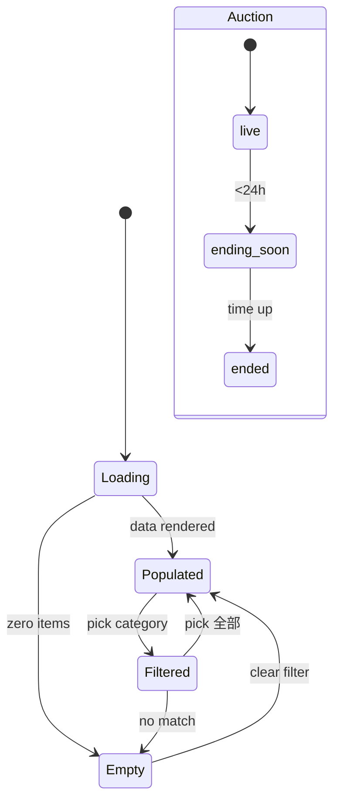
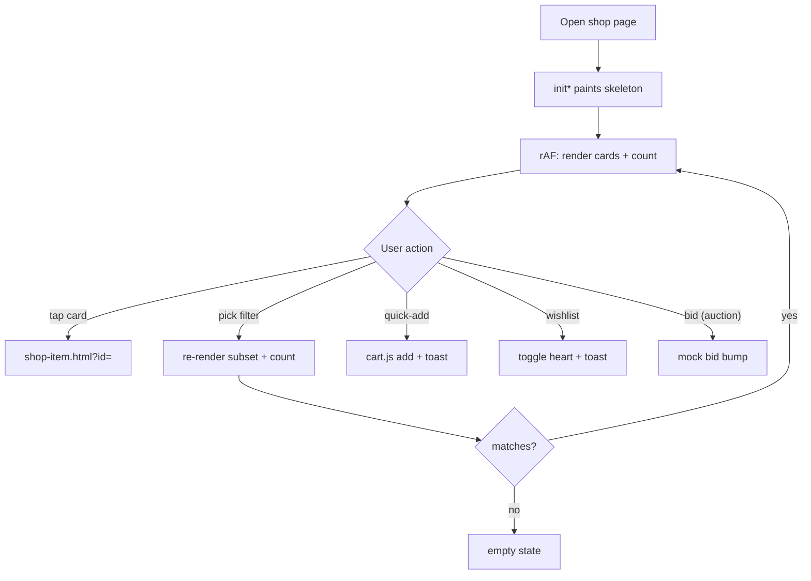

# Browse Shop (Product Listing)

> The PLP layer that renders every shop catalogue — main shop, creators, events, popcorn, auction — as a uniform 2:3 card grid with category filtering, image-fallback, and per-card quick actions.

## Human Overview

### What this feature does

- The storefront's **listing surface**. Anyone (guest or logged-in fan) lands on a shop page and sees a grid of product cards.
- One render engine (`shop-render.js`) drives **six** different listings off the same `window.ZTOR_SHOP` data: products, popcorn vouchers, ticketed events, auctions, the creator directory, and per-creator storefronts.
- Each card shows a 2:3 image, a category/date line, a name, and a price (or pop-points / current-bid / countdown for the special types).
- A horizontal **filter bar** narrows the grid by category; a live count ("48 件") updates as you filter.
- Cards carry quick actions placed over or under the image: a **wishlist heart**, a footer **quick-add** button (goods/events), or a **bid** button (auctions).
- Tapping a card navigates to its detail page (`shop-item.html?id=<id>`).
- Available immediately, no login required to browse.

### Approach in one line

One vanilla render module renders all shop grids from a shared in-memory data namespace, with a three-step image-fallback chain so a card never shows a broken glyph; quick-add and wishlist are delegated mock interactions.

### The math, in plain numbers ⚠️ READ TO VALIDATE

**No money math — display/selection logic only.** The two load-bearing rules:

**1. Image fallback chain (PLP).** For each card, the image source is resolved by `prodImg(id)` (`assets/shop-render.js:24-27`):

```
prodImg(id) =
  IF imgMap[id] exists  → "assets/images/shop/g/" + imgMap[id]   (curated archetype WebP)
  ELSE                   → "https://picsum.photos/seed/<id>/480/720"   (seeded placeholder)
```

- Plus a **runtime** third tier: every `` carries `onerror` (`assets/shop-render.js:29`) that, if the resolved src fails to load, hides the image and adds `brand-tile brand-tile--3` to the parent (a CSS gradient tile). So the visible order is **imgMap WebP → picsum seed → gradient tile**. A card is never a broken-image glyph.
- Worked example: card `ztor-logo-heavyweight-tee-black` → `imgMap` has `"book-2.webp"` → renders `assets/images/shop/g/book-2.webp`. A card with no imgMap entry → `picsum.photos/seed/<that-id>/480/720`. If both 404 → gradient tile.

**2. Filter "show all" rule** (`assets/shop-render.js:264-268`): a selection counts as "all" when the category set is empty OR contains `全部`. Otherwise the grid is `items.filter(p => selectedCats.some(c => match(p,c)))`. Default `match` is exact `p.cat === cat` (`:261`); the creator directory overrides it to substring containment (`role.indexOf(cat) >= 0`, `:484`). The count badge then reads `filtered.length + ' ' + unit` (unit defaults to `件`, `:256`).

Source for each number in parentheses.

### Feature at a glance

| Item | Details |
| --- | --- |
| Feature ID | SHOP-001 |
| Domain | shop |
| Primary users | Guest, Fan |
| Implementation status | implemented |
| Confidence | high |
| Main routes | `shop.html`, `shop-creators.html`, `shop-events.html`, `shop-popcorn.html`, `shop-auction.html` |
| Main result | The user sees a filtered grid of products and can tap through to a detail page, quick-add, wishlist, or bid |
| Real vs mock | Real: rendering, filtering, image fallback, countdown ticker. Mock: wishlist + bid are local DOM toggles; product imagery is archetype WebP placeholders; quick-add persists to a localStorage cart only |

### User-visible states

| State | Meaning | What the user sees | Available action |
| --- | --- | --- | --- |
| Loading | Data not yet painted | Shimmer skeleton cards (8–10) | Wait |
| Populated | Items rendered | Grid of 2:3 cards + count | Filter · tap card · quick-add · wishlist · bid |
| Empty | Filter matched nothing | "這個分類暫時沒有商品" empty block | Pick another filter |
| Filtered | A category is active | Subset of cards + updated count | Re-filter · clear via 全部 |
| Sold-out card (goods/event) | `soldOut:true` | "售完"/"完售" flag, "售完補貨中"/"已完售" price, no quick-add | Tap for detail only |
| Auction — live | `ends` in future | Countdown pill + 目前出價 + 出價 button | Bid (mock) |
| Auction — ending soon | `<24h` left | Pill in `--soon` style | Bid |
| Auction — ended | `ends` passed | "已結束" pill + 成交價 + disabled "拍賣結束" | View only |

### Main actions

| Action | Who can use it | When it appears | Result |
| --- | --- | --- | --- |
| Tap card | Guest, Fan | Always | Navigate to `shop-item.html?id=<id>` |
| Filter by category | Guest, Fan | When a `.shop-filter` bar exists | Grid + count update |
| Quick-add | Guest, Fan | Goods/event cards, not sold-out | Adds to localStorage cart + drawer flash + toast (mock) |
| Wishlist heart | Guest, Fan | All product/event/auction cards | Local DOM toggle + toast (no persistence) |
| Bid | Guest, Fan | Live auction cards | Mock bid bump (no real ledger write on PLP) |

### Important business rules

- **One render engine, six grids.** `ZTOR_SHOP_RENDER` exposes `initShop / initPopcorn / initShopEvents / initAuction / initCreators / initCreatorPage` etc.; each reads a different array off `window.ZTOR_SHOP` (`assets/shop-render.js:418-485`).
- **Image never breaks** — three-tier fallback (see math).
- **Sold-out cards drop the quick-add** and show a status flag instead of a price (`assets/shop-render.js:96-108`, `:131-144`).
- **Auction countdown is live** — a 1s interval re-paints every `[data-countdown]` pill and flips the soon/ended classes (`assets/shop-render.js:376-392`).
- **Filtering does not navigate** — control clicks inside a card call `preventDefault()` + `stopPropagation()` (`assets/shop-render.js:328-329`).

### Related features

- [Product Detail Page (Goods)](./product-detail.md)
- [Quick Add to Cart (PLP)](./quick-add.md)
- [Wishlist / Save Item](./wishlist.md)
- [Shopping Cart](./shopping-cart.md) · [Checkout](./checkout.md)

### Known gaps or uncertainties

- Product imagery is **archetype WebP placeholders** (HANDOFF "Higgsfield imagery"); real per-product photography swaps in later.
- PLP **wishlist and bid are mock** — no persistence (wishlist) and no `ZtorLedger` write (bid mutates only the card DOM). Real bidding happens on the auction PDP/sheet.
- PLP quick-add fires **two** handlers (mock feedback + real cart add) — see [quick-add.md](./quick-add.md).

---

# AI and Engineering Specification

## 1. Canonical metadata

```yaml
feature:
  id: SHOP-001
  name: Browse Shop (Product Listing)
  slug: browse-shop
  domain: shop
  status: implemented
  confidence: high
  actors: [guest, fan]
  routes: [shop.html, shop-creators.html, shop-events.html, shop-popcorn.html, shop-auction.html]
  permissions: []
  featureFlags: []
  relatedFeatures: [SHOP-002, SHOP-005, SHOP-007]
  sourceFiles:
    - assets/shop-render.js
    - assets/shop-data-products.js
    - assets/shop-data-popcorn.js
    - assets/shop-data-events.js
    - assets/shop-data-auction.js
    - assets/shop-data-creators-a.js
    - assets/shop-data-creators-b.js
    - assets/shop-data-creators-c.js
    - assets/shop-data-imgmap.js
    - assets/shop-filter-sheet.js
  lastAuditedAt: "2026-06-25"
```

## 2. Source-code evidence

| Type | File | Symbol or line | Evidence |
| --- | --- | --- | --- |
| Render | `assets/shop-render.js` | `productCardHtml` `:93-110` | Goods card markup (media, body, footer price + quick-add) |
| Render | `assets/shop-render.js` | `popcornCardHtml` `:113-126` | Popcorn card with pop-points + 兌換 chip |
| Render | `assets/shop-render.js` | `eventCardHtml` `:129-146` | Event card (date·venue cat line, ticket quick-add) |
| Render | `assets/shop-render.js` | `auctionCardHtml` `:180-211` | Auction card (countdown pill, current bid, bid CTA) |
| Render | `assets/shop-render.js` | `creatorCardHtml` `:214-221` | Creator directory card |
| Data | `assets/shop-render.js` | `prodImg` `:24-27` | imgMap → picsum fallback |
| State | `assets/shop-render.js` | `ON_ERR` `:29` | onerror → hide img + gradient tile |
| Logic | `assets/shop-render.js` | `wireFilter` `:259-295` | Filter apply/count/active-state; exposes `__shopFilter` for the mobile sheet |
| Logic | `assets/shop-render.js` | `wireCardActions` `:320-373` | Delegated wishlist / quick-add / bid (mock) |
| Logic | `assets/shop-render.js` | `startCountdowns` `:376-392` | 1s auction countdown ticker |
| Render | `assets/shop-render.js` | `skeletonHtml`/`emptyHtml` `:229-247` | Loading + empty states |
| Init | `assets/shop-render.js` | `window.ZTOR_SHOP_RENDER` `:418-710` | Per-page initializers |
| Page | `shop.html` | `#shopGrid` `:539`, `initShop()` `:771` | Main shop mount + boot |
| Page | `shop-auction.html` | `#auctionGrid` `:535`, `initAuction()` `:761` | Auction mount + boot |
| Page | `shop-events.html` | `initShopEvents()` `:769` | Events boot |
| Page | `shop-popcorn.html` | `initPopcorn()` `:776` | Popcorn boot |
| Page | `shop-creators.html` | `#creatorGrid` `:537`, `initCreators()` `:769` | Creator directory boot |
| Sheet | `assets/shop-filter-sheet.js` | (mobile multi-select sheet) | Reads `barEl.__shopFilter` to drive the same render |

## 3. Actors and permissions

| Actor | Permission or role | Allowed actions | Restricted actions |
| --- | --- | --- | --- |
| Guest | not authenticated | Browse, filter, tap card, quick-add, wishlist (mock), bid (mock) | None on the PLP — the auth gate is downstream (cart checkout / save) |
| Fan (logged-in) | mock `body[data-auth]='logged-in'` | Same as guest | None |

The PLP itself is **ungated**; auth gating engages only at checkout / persistent-save, handled by `auth.js` and `cart.js`.

## 4. State model

Per-grid lifecycle:

| State ID | State name | Entry condition | Exit condition | Next possible states |
| --- | --- | --- | --- | --- |
| S0 | Loading | `init*` called; `showSkeleton` painted | `requestAnimationFrame` callback runs | Populated, Empty |
| S1 | Populated | `items.length > 0` rendered | Filter applied | Filtered, Empty |
| S2 | Filtered | A non-全部 category selected | 全部 or another category | Populated, Empty |
| S3 | Empty | `filtered.length === 0` | Different filter | Populated, Filtered |

Auction-card sub-state (per card, driven by the countdown ticker): `live → ending-soon → ended` (timer-driven, `:376-392`).



## 5. Action visibility and availability matrix

| Action ID | Label (actual copy) | UI location | Actor | Required state | Conditions | Hidden when | Disabled when | Result |
| --- | --- | --- | --- | --- | --- | --- | --- |
| A1 | (whole card) | Card `<a>` | Guest/Fan | Populated | — | never | never | Navigate `shop-item.html?id=` |
| A2 | 全部 / 電影周邊 / 服飾 … | `.shop-filter__item` | Guest/Fan | any | filter bar present | no bar | — | Re-render + count |
| A3 | 加入購物車 (icon) | `.shop-card__qa` footer | Guest/Fan | Populated, not sold-out | goods/event | sold-out / popcorn / auction / creator cards | — | Cart add + toast |
| A4 | 加入願望清單 (heart) | `.rf-wish` over media | Guest/Fan | Populated | product/event/auction cards | — | — | Toggle `aria-pressed` + toast |
| A5 | 出價 | `.rf-bid` over media | Guest/Fan | Auction live | not ended | ended → "拍賣結束" | ended | Mock bid bump |

## 6. Functional requirements

| Requirement ID | Requirement | Evidence | Status |
| --- | --- | --- | --- |
| SHOP-001-FR-001 | The system shall render each shop grid from its array in `window.ZTOR_SHOP` via a type-specific card builder | `shop-render.js:418-485` | Implemented |
| SHOP-001-FR-002 | The system shall resolve each card image via imgMap→picsum→gradient-tile fallback | `shop-render.js:24-29` | Implemented |
| SHOP-001-FR-003 | The system shall show a loading skeleton until data is painted | `shop-render.js:239-247` | Implemented |
| SHOP-001-FR-004 | The system shall filter the grid by category and update a live count | `shop-render.js:259-295` | Implemented |
| SHOP-001-FR-005 | The system shall show an empty state when a filter matches nothing | `shop-render.js:227,229-234` | Implemented |
| SHOP-001-FR-006 | The system shall live-update auction countdowns each second and flip soon/ended states | `shop-render.js:376-392` | Implemented |
| SHOP-001-FR-007 | The system shall suppress card navigation when a quick action is clicked | `shop-render.js:328-329` | Implemented |
| SHOP-001-FR-008 | The system shall hide quick-add on sold-out goods/event cards | `shop-render.js:108,144` | Implemented |
| SHOP-001-FR-009 | The system shall expose filter context (`__shopFilter`) so the mobile sheet drives the same render | `shop-render.js:287` | Implemented |

## 7. User scenarios

```text
Scenario ID: SHOP-001-UC-001
Name: Browse and filter the main shop
Actor: Guest
Preconditions: shop.html loaded; ZTOR_SHOP.products populated
Trigger: Page boot calls ZTOR_SHOP_RENDER.initShop()
Main flow:
  1. Skeleton cards paint.
  2. On the next animation frame, product cards render; count shows "N 件".
  3. User clicks 服飾 in the filter bar.
  4. Grid re-renders to apparel only; count fades to the new number; 服飾 becomes active.
  5. User taps a card → navigates to shop-item.html?id=<id>.
Alternative flows:
  4a. User clicks a category with no items → empty block shown.
Error flows:
  2a. A card image 404s → onerror hides it and paints a gradient tile.
Final state: Detail page open (or filtered grid shown).
Related requirements: FR-001, FR-002, FR-004, FR-005
```

```text
Scenario ID: SHOP-001-UC-002
Name: Bid from an auction card (mock)
Actor: Fan
Preconditions: shop-auction.html loaded; an auction is live
Trigger: User clicks 出價 on a live card
Main flow:
  1. Card navigation is suppressed.
  2. Current bid bumps by an increment (500/1000/2000 by tier).
  3. Bid count +1; state flips to 最高出價.
  4. Toast: "出價成功，你目前是最高出價者".
Alternative flows:
  - Ended cards show a disabled "拍賣結束" and cannot bid.
Error flows: none (mock).
Final state: Card reflects the new leading bid (DOM only).
Related requirements: FR-006, FR-007
```

## 8. User-flow diagrams



## 9. Data model

The PLP source arrays under `window.ZTOR_SHOP` (one card entry each):

| Entity / object | Field | Type | Required | Source | Meaning |
| --- | --- | --- | --- | --- | --- |
| product | id | string | yes | `shop-data-products.js` | Unique id; `?id=` key + image seed |
| product | name | string | yes | same | Card title |
| product | cat | string | no | same | Category (filter key + cat line) |
| product | ntd | number | yes | same | NTD price (0 = 免費) |
| product | hkd | number | no | same | Optional HKD sub-price |
| product | badge | string | no | same | Flag pill (限量 / 新品 / Bundle) |
| product | soldOut | bool | no | same | Drops quick-add, shows 售完 |
| popcornItem | pop / note | number / string | yes / no | `shop-data-popcorn.js` | Pop-point cost + footnote |
| shopEvent | date, venue, ntd | string/number | yes | `shop-data-events.js` | Event cat line + price |
| auction | ends, bid, bids | string/number | yes | `shop-data-auction.js` | End date, current bid, bid count |
| creator | slug, name, role, followers | string | yes | `shop-data-creators-*.js` | Directory card + storefront link |
| imgMap | `<id>` → filename | map | no | `shop-data-imgmap.js` | Curated archetype WebP per id |

## 10. API and service behaviour

No server. The render layer is a pure presentation module reading the global `window.ZTOR_SHOP` namespace.

| Method | Function | Purpose | Request | Response | Errors | Called by |
| --- | --- | --- | --- | --- | --- | --- |
| `ZTOR_SHOP_RENDER.initShop()` | render | Paint main shop grid + filter | — | DOM into `#shopGrid` | none | `shop.html:771` |
| `initAuction()` | render | Auction grid + countdowns | — | DOM into `#auctionGrid` | none | `shop-auction.html:761` |
| `initShopEvents()` | render | Events grid | — | DOM | none | `shop-events.html:769` |
| `initPopcorn()` | render | Popcorn grid | — | DOM | none | `shop-popcorn.html:776` |
| `initCreators()` | render | Creator directory | — | DOM into `#creatorGrid` | none | `shop-creators.html:769` |

Downstream services consumed by card actions: `window.ZtorCart` (cart add — quick-add, see [quick-add.md](./quick-add.md)). Bid/wishlist on the PLP are mock and write no service.

## 11. Calculations and formulas

| Calc ID | Name | Formula | Inputs | Rounding | Unit | Source |
| --- | --- | --- | --- | --- | --- | --- |
| C1 | Image source | imgMap[id] ? g/file : picsum(id) | id, imgMap | — | URL | `shop-render.js:24-27` |
| C2 | Filter subset | items.filter(p ⇒ cats.some(c ⇒ match(p,c))) | items, cats | — | list | `shop-render.js:266-268` |
| C3 | Count text | `filtered.length + ' ' + unit` | list length | — | 件/位/張 | `shop-render.js:256` |
| C4 | Countdown remaining | `new Date(ends+'T23:59:00') − now` | ends ISO | floor | ms→d/h/m/s | `shop-render.js:153-167` |
| C5 | Mock bid increment | bid≥50000→+2000; ≥10000→+1000; else +500 | current bid | — | NTD | `shop-render.js:355` |

Notes: countdown treats the bare `ends` date as 23:59 local. "All" = empty set or contains `全部`.

## 12. Notifications and side effects

| Trigger | Recipient | Channel | Message / event | Source |
| --- | --- | --- | --- | --- |
| Wishlist toggle on | User | Glass toast | "已加入願望清單" + 查看 | `shop-render.js:337` |
| Quick-add | User | Glass toast | "「<name>」已加入購物車" + 去結帳 | `shop-render.js:343` |
| Mock bid | User | Glass toast | "出價成功，你目前是最高出價者" | `shop-render.js:369` |
| Quick-add | Cart store | localStorage + drawer flash | (cart add via cart.js capture handler) | `cart.js:217-231` |

## 13. Error and edge-case handling

| Condition | Current system behaviour | User-visible result | Recovery |
| --- | --- | --- | --- |
| Card image fails to load | `onerror` hides img, adds `brand-tile--3` | Gradient tile with no glyph | — |
| imgMap missing for id | Falls back to picsum seed | Seeded placeholder photo | — |
| Filter matches nothing | `renderInto` paints `emptyHtml()` | "這個分類暫時沒有商品" | Pick another filter |
| Data array missing/empty | `items` defaults to `[]` → empty state | Empty block | — |
| Auction already ended at load | Pill renders "已結束", CTA disabled | View-only card | — |
| Sold-out goods/event | Quick-add omitted, price → 售完補貨中/已完售 | Card not addable | Open PDP |

## 14. Acceptance criteria

```gherkin
Feature: Browse Shop (Product Listing)

  Scenario: Grid renders with a live count
    Given the main shop page has loaded
    When initShop runs
    Then product cards appear in #shopGrid
    And #shopCount shows the number of items followed by "件"

  Scenario: Filtering narrows the grid
    Given the shop grid is populated
    When I click the 服飾 filter
    Then only apparel cards remain
    And the count updates to the apparel total
    And 服飾 is marked active

  Scenario: Image never breaks
    Given a card whose id has no imgMap entry
    Then its image src is a picsum seed URL
    And if that fails the card shows a gradient tile, not a broken image

  Scenario: Empty filter
    Given a category with no items
    When I select it
    Then I see "這個分類暫時沒有商品"

  Scenario: Auction countdown is live
    Given a live auction card
    Then its countdown pill decrements every second
    And when time passes zero it shows "已結束" and disables 出價
```

## 15. Dependencies and relationships

- **Parent feature:** none (entry surface).
- **Child features:** SHOP-002 (PDP), SHOP-005 (quick-add), SHOP-007 (wishlist).
- **Shared services:** `window.ZtorCart` (cart add), `window.ScrollTrigger` (optional refresh).
- **Shared components:** `.shop-card`, `.shop-filter`, `.ds-skeleton`, `.rf-toast`, `.rf-empty`, `.glass-tabs`.
- **Events emitted / consumed:** consumes nothing directly; downstream cart add emits `cart:change`. The mobile filter sheet reads `barEl.__shopFilter`.
- **Config / data dependencies:** all six `shop-data-*.js` arrays + `shop-data-imgmap.js`, loaded before `shop-render.js` on each page.

## 16. Open questions and implementation gaps

### Confirmed implementation gaps

- Product imagery is archetype WebP placeholders (HANDOFF "Higgsfield imagery — swap points"); real photography pending.
- PLP wishlist toggle has **no persistence** — pure DOM (`shop-render.js:333-338`). The persistent, auth-gated save lives on the PDP / `auth.js` gate (see [wishlist.md](./wishlist.md)).
- PLP bid mutates **only the card DOM** (`shop-render.js:350-370`) — no `ZtorLedger.addBid`. Real bidding is the auction PDP/sheet flow (see `../auction/`).

### Conflicting implementations

- Quick-add triggers **two** independent listeners: `shop-render.js`'s bubble handler (mock checkmark + toast) and `cart.js`'s capture handler (real `ZtorCart.add`). Intentional and documented in `cart.js:218-221`, but worth noting as dual behaviour. Detailed in [quick-add.md](./quick-add.md).

### Unresolved questions

- Q: Does the seeded picsum fallback work offline / in a headless capture? Why it matters: HANDOFF notes lazy picsum stills don't render until scrolled. Files inspected: `shop-render.js`. Owner: frontend. Blocks-confidence? no.
