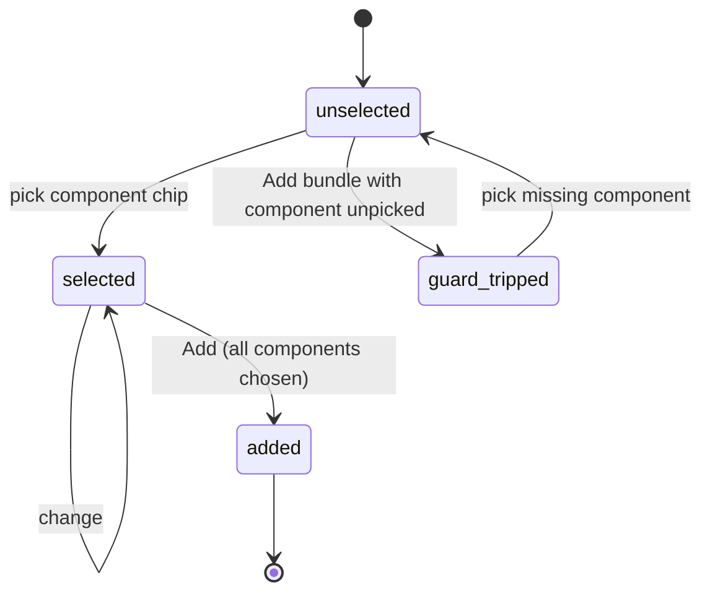
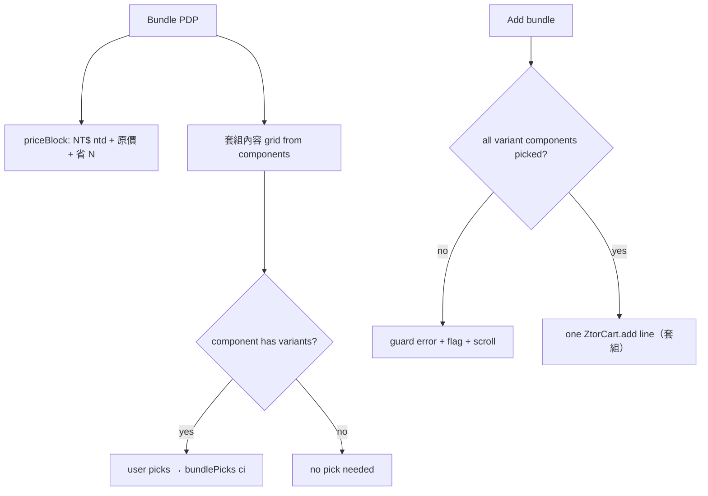

# Bundle Product (套組)

> A bundle variant of the PDP: it lists each component with its own mini-gallery and per-item variant picker, shows a struck original price and a "省 N" savings badge, and adds the whole set to the cart as one line.

## Human Overview

### What this feature does

- A **套組 (bundle)** is a curated set sold as one SKU — e.g. a "movie-night blanket set" of blanket + eye-mask + candle.
- Its detail page reuses the goods PDP shell ([product-detail.md](./product-detail.md)) but adds a **"套組內容" section**: every component shown with its **own photo mini-gallery**, its **name**, an optional **per-component variant picker** (e.g. blanket colour), and a **"查看單品" link** to that component's standalone PDP (when it has its own id).
- The price block shows the bundle price plus a **struck-through 原價** and a brand-yellow **省 NT$ N** savings badge — the headline reason to buy the set.
- A **per-component select-guard** forces the user to choose options for any component that has variants before the bundle can be added.
- **Adds as ONE cart line** titled "<name>（套組）" at the bundle price — never as separate component lines.

### Approach in one line

Reuse the goods buy-column for price/wishlist/disclosures, append a component grid driven by `components[]`, derive the savings from `wasNtd − ntd`, and gate the single bundle add on every component's variant being chosen.

### The math, in plain numbers ⚠️ READ TO VALIDATE

**The savings math.** The struck original and the 省 N badge both come from `priceBlock()` (`shop-detail-render.js:90-94`):

```
showWas  = wasNtd exists AND wasNtd > ntd
原價 line = "原價 NT$ " + wasNtd            (struck through)
省 N badge = "省 NT$ " + (wasNtd − ntd)
```

So **省 N = wasNtd − ntd**, where `wasNtd` is the bundle's stated original price (the sum of the components bought separately) and `ntd` is the discounted bundle price. The badge renders only when `wasNtd > ntd` (no negative or zero savings shown).

**Worked example — `movie-night-blanket-set`** (`shop-data-detail.js:49-63`):

| Component | Sold-separately 原價 (NT$) |
| --- | --- |
| 超細纖維觀影毯 | (part of the curated original) |
| 全遮光記憶棉眼罩 | (…) |
| 爆米花香氛蠟燭 200g | (…) |
| **Sum = `wasNtd`** | **1,740** |

- Bundle price `ntd` = **1,380** (the base PLP `movie-night-blanket-set` entry).
- 省 N = `wasNtd − ntd` = **1,740 − 1,380 = NT$ 360**.
- Page shows: **NT$ 1,380** headline · ~~原價 NT$ 1,740~~ struck · **省 NT$ 360** badge. (Matches the copy "較單買省下 NT$360" in the description, `shop-data-detail.js:52`.)

Second example — `ztor-double-wall-glass-set` (`:64-76`): `wasNtd` 1,120, description states "省 NT$200", so bundle `ntd` = 920 and 省 N = 1,120 − 920 = **NT$ 200**.

> Note: the renderer derives 省 N purely from `wasNtd` and the live `ntd`; it does **not** independently sum the component prices (components carry no price field in the data). So the savings shown is only as correct as the curated `wasNtd`. Validate that `wasNtd` truly equals the sum of components bought separately.

Source for each number in parentheses.

### Feature at a glance

| Item | Details |
| --- | --- |
| Feature ID | SHOP-003 |
| Domain | shop |
| Primary users | Guest, Fan |
| Implementation status | implemented |
| Confidence | high |
| Main routes | `shop-item.html?id=<bundle-id>` |
| Main result | The user sees what's inside the set and its savings, picks any component options, and adds the whole bundle as one cart line |
| Real vs mock | Real: component grid, savings badge, per-item guard, single-line add. Mock: imagery placeholders; wishlist no-persist |

### User-visible states

| State | Meaning | What the user sees | Available action |
| --- | --- | --- | --- |
| Bundle loaded | type resolved as bundle | Gallery + price w/ 原價+省N + 套組內容 grid | Inspect · pick · add |
| Component variant unselected | A component has variants, none picked | Component chips at rest | Pick |
| Guard tripped | Add tapped with a component unpicked | Error "請先為套組內的商品選擇選項" + flagged component(s) + scroll-to | Pick the missing component |
| All picked | Every variant-bearing component chosen | Chips highlighted | Add |
| Component mini-gallery | Component has >1 image | Component thumbs | Swap component image |

### Main actions

| Action | Who | When | Result |
| --- | --- | --- | --- |
| Component thumb swap | Guest/Fan | Component has >1 image | Component main image swaps |
| Pick component variant | Guest/Fan | Component has variants | Records `bundlePicks[ci]`, clears guard |
| 查看單品 | Guest/Fan | Component has an `id` | Navigate to that component's PDP |
| Add bundle | Guest/Fan | type bundle | Per-component guard → one `ZtorCart.add` line |
| Wishlist | Guest/Fan | always | DOM toggle + toast |

### Important business rules

- **Bundle classification:** `type:"bundle"` in detail, or badge "Bundle", or a name matching `套組|組合|珍藏組` (`shop-detail-render.js:58`).
- **省 N badge only when `wasNtd > ntd`** (see math).
- **Per-component guard:** every component with a `variants` array must have a pick in `bundlePicks` before add (`:567-580`).
- **One line, bundle price:** add title `<name>（套組）`, price `item.ntd || 0`, qty (`:582`).
- Component variants are independent of the top-level goods variant guard — a bundle's buy column has no top-level variant rows of its own; the guard is purely per-component.

### Related features

- [Product Detail Page (Goods)](./product-detail.md) — the shared shell
- [Browse Shop](./browse-shop.md)
- [Shopping Cart](./shopping-cart.md) · [Checkout](./checkout.md) · [Mock Payment](../payments/mock-payment.md)

### Known gaps or uncertainties

- Imagery is archetype WebP placeholders (HANDOFF).
- 省 N depends on a hand-curated `wasNtd`; components have **no price field**, so the renderer can't verify the original equals the component sum.
- A component without an `id` shows no 查看單品 link (`:302`).

---

# AI and Engineering Specification

## 1. Canonical metadata

```yaml
feature:
  id: SHOP-003
  name: Bundle Product (套組)
  slug: bundle-product
  domain: shop
  status: implemented
  confidence: high
  actors: [guest, fan]
  routes: [shop-item.html]
  permissions: []
  featureFlags: []
  relatedFeatures: [SHOP-002, SHOP-001]
  sourceFiles:
    - assets/shop-detail-render.js
    - assets/shop-data-detail.js
  lastAuditedAt: "2026-06-25"
```

## 2. Source-code evidence

| Type | File | Symbol or line | Evidence |
| --- | --- | --- | --- |
| Classify | `assets/shop-detail-render.js` | `isBundle` `:58` | type:"bundle" / badge / name regex |
| Price | same | `priceBlock` `:90-94` | 原價 struck + 省 N = wasNtd − ntd |
| Render | same | `bundleContentsHtml` `:284-309` | Component grid w/ mini-gallery + variants + 查看單品 |
| Render | same | `renderBundle` `:311-321` | Bundle page assembly (gallery + goodsBuy + contents + related) |
| Behaviour | same | bundle thumb swap `:469-477` | Per-component image swap |
| Behaviour | same | bundle chip select `:479-489` | `bundlePicks[ci]` + clear guard |
| Guard | same | `doBundleAdd` `:567-586` | Per-component guard + single-line add |
| Data | `assets/shop-data-detail.js` | `movie-night-blanket-set` `:49-63` | wasNtd 1740, 3 components |
| Data | same | `ztor-double-wall-glass-set` `:64-76` | wasNtd 1120, 2 components |

## 3. Actors and permissions

| Actor | Permission or role | Allowed actions | Restricted actions |
| --- | --- | --- | --- |
| Guest | not authenticated | View, pick component variants, add bundle, wishlist (mock) | Checkout requires login (downstream) |
| Fan | mock logged-in | Same | — |

## 4. State model

Per component with variants:

| State ID | State name | Entry condition | Exit condition | Next states |
| --- | --- | --- | --- | --- |
| C0 | unselected | Component variants rendered | Pick a chip | selected |
| C1 | selected | `bundlePicks[ci]` set | Change pick | selected |
| BG0 | guard-idle | guard hidden | Add with a component unpicked | guard-tripped |
| BG1 | guard-tripped | missing component(s) | Any component pick | guard-idle |



## 5. Action visibility and availability matrix

| Action ID | Label | UI location | Actor | Required state | Conditions | Hidden when | Disabled when | Result |
| --- | --- | --- | --- | --- | --- | --- | --- |
| A1 | (component thumb) | `.pdp-bundle-item__thumb` | any | component >1 img | — | single img | — | Swap component image |
| A2 | (component chip) | `.pdp-bundle-chip` | any | component has variants | not sold-out | no variants | `option.soldOut` | Record bundlePicks |
| A3 | 查看單品 › | `.pdp-bundle-item__link` | any | component has id | — | no id | — | Navigate to component PDP |
| A4 | 加入購物車 | `.pdp-buy__add` | any | bundle | per-component guard passes | — | item.soldOut | One bundle line add |
| A5 | (省 NT$ N) | `.pdp-price__save` | — (display) | wasNtd > ntd | — | wasNtd≤ntd | — | Shows savings |

## 6. Functional requirements

| Requirement ID | Requirement | Evidence | Status |
| --- | --- | --- | --- |
| SHOP-003-FR-001 | The system shall classify an item as a bundle by type/badge/name | `:58` | Implemented |
| SHOP-003-FR-002 | The system shall show a struck 原價 and 省 N badge when wasNtd > ntd | `:90-94` | Implemented |
| SHOP-003-FR-003 | The system shall render each component with its own mini-gallery, name, optional variants, and 查看單品 link | `:284-309` | Implemented |
| SHOP-003-FR-004 | The system shall swap a component's main image on its thumb click | `:469-477` | Implemented |
| SHOP-003-FR-005 | The system shall require a pick for every variant-bearing component before add | `:567-580` | Implemented |
| SHOP-003-FR-006 | The system shall scroll to and flag unpicked components when the guard trips | `:573-578` | Implemented |
| SHOP-003-FR-007 | The system shall add the bundle as ONE cart line titled "<name>（套組）" at the bundle price | `:581-585` | Implemented |

## 7. User scenarios

```text
Scenario ID: SHOP-003-UC-001
Name: Add a bundle with a component option
Actor: Guest
Preconditions: shop-item.html?id=movie-night-blanket-set loaded
Trigger: User wants the set
Main flow:
  1. Price shows NT$ 1,380, struck 原價 NT$ 1,740, badge 省 NT$ 360.
  2. 套組內容 lists 3 components; the blanket offers colour 霧灰/墨黑.
  3. User picks 霧灰 for the blanket.
  4. User taps 加入購物車.
  5. doBundleAdd: no missing components → ZtorCart.add ONE line "…（套組）" at 1,380.
  6. Toast + cart drawer opens.
Alternative flows:
  3a. User taps Add before picking the blanket colour → guard "請先為套組內的商品選擇選項";
      the blanket component flashes; page scrolls to 套組內容.
Error flows: ZtorCart absent → add no-ops.
Final state: One bundle line in cart.
Related requirements: FR-002, FR-005, FR-006, FR-007
```

## 8. User-flow diagrams



## 9. Data model

`detail[id]` bundle shape (over the base entry that supplies `ntd`).

| Entity | Field | Type | Required | Source | Meaning |
| --- | --- | --- | --- | --- | --- |
| detail (bundle) | type | "bundle" | recommended | `shop-data-detail.js:50` | Forces bundle classification |
| detail | wasNtd | number | no | `:51` | Original price → struck + savings base |
| detail | images | string[] | no | `:53` | Top-level composite gallery |
| detail | components | {id?,name,images[],variants?}[] | yes (for the section) | `:54-59` | What's inside |
| component | id | string | no | `:302` | Enables 查看單品 link |
| component | name | string | yes | `:55-58` | Component title |
| component | images | string[] | no | `:55` | Component mini-gallery (else picsum) |
| component | variants | same shape as goods variants | no | `:56` | Per-component options |
| base entry | ntd | number | yes | PLP array | Bundle sale price (add line price) |

## 10. API and service behaviour

No server. Consumes `ZtorCart.add` (one line) + `ZtorCart.openDrawer` + `DSToast` — same as the goods PDP.

| Method | Function | Purpose | Request | Response | Errors | Called by |
| --- | --- | --- | --- | --- | --- | --- |
| `ZtorCart.add({id,title:'<name>（套組）',price:ntd,qty})` | cart store | Add the bundle as one line | line obj | mutate cart | none | `doBundleAdd` `:582` |

## 11. Calculations and formulas

| Calc ID | Name | Formula | Inputs | Rounding | Unit | Source |
| --- | --- | --- | --- | --- | --- | --- |
| C1 | Savings | `省 N = wasNtd − ntd` (only if wasNtd > ntd) | wasNtd, ntd | none | NTD | `:90-93` |
| C2 | Component image | component.images→g/file, else picsum(id-c<ci>) | component, ci | — | URL[] | `:290-291` |
| C3 | Missing-components | components where `variants && bundlePicks[ci]==null` | components, bundlePicks | — | list | `:570` |

Worked: blanket set → 1740 − 1380 = **360**; glass set → 1120 − 920 = **200**.

## 12. Notifications and side effects

| Trigger | Recipient | Channel | Message / event | Source |
| --- | --- | --- | --- | --- |
| Bundle add | User | Toast | "「<name>」已加入購物車" + 去結帳 | `:583` |
| Bundle add | Cart store | localStorage + drawer | `ZtorCart.add` → `cart:change` | `:582-584` |
| Guard trip | User | Inline error + component flash + scroll | "請先為套組內的商品選擇選項" | `:573-578` |

## 13. Error and edge-case handling

| Condition | Current behaviour | User-visible result | Recovery |
| --- | --- | --- | --- |
| Component missing options on add | Guard error, flag + scroll to section | "請先為套組內的商品選擇選項" | Pick the component |
| `wasNtd ≤ ntd` or absent | No 原價/省 N rendered | Plain price only | — |
| Component has no images | Falls back to picsum seed `id-c<ci>` | Placeholder image | — |
| Component has no id | No 查看單品 link | Component non-clickable | — |
| Bundle has no components | 套組內容 section omitted | Renders as a plain goods page | — |

## 14. Acceptance criteria

```gherkin
Feature: Bundle Product (套組)

  Scenario: Savings badge math
    Given a bundle with wasNtd 1740 and price 1380
    Then the page shows a struck "原價 NT$ 1,740"
    And a savings badge "省 NT$ 360"

  Scenario: Per-component guard
    Given a bundle whose blanket component has colour options
    And I have not chosen a colour
    When I tap 加入購物車
    Then I see "請先為套組內的商品選擇選項"
    And the blanket component is flagged and scrolled into view

  Scenario: Single-line add
    Given every variant-bearing component is chosen
    When I tap 加入購物車
    Then exactly one cart line "<name>（套組）" is added at the bundle price
```

## 15. Dependencies and relationships

- **Parent feature:** SHOP-002 (shares the PDP shell, gallery, disclosures, related rail, wishlist).
- **Child features:** none.
- **Shared services:** `ZtorCart`, `DSToast`, `DSZoom`.
- **Shared components:** `.pdp-bundle*`, `.pdp-price__was/__save`, `.glass-tabs`, `.pdp-gallery`, plus the goods buy column.
- **Events:** add → `cart:change`.
- **Config / data:** `shop-data-detail.js` bundle entries; base `ntd` from a PLP array.

## 16. Open questions and implementation gaps

### Confirmed implementation gaps

- Imagery placeholders (HANDOFF).
- Components carry no price → savings cannot be auto-verified against the component sum.

### Conflicting implementations

- None. The bundle reuses `goodsBuyHtml` for its buy column but has no top-level variants of its own — its guard logic (`doBundleAdd`) is per-component and separate from the goods `doAdd` path.

### Unresolved questions

- Q: Should `wasNtd` be derived from summing component prices instead of hand-set? Why it matters: prevents a savings figure drifting from reality. Files inspected: `shop-detail-render.js:90-94`, `shop-data-detail.js`. Owner: product/business. Blocks-confidence? no.
