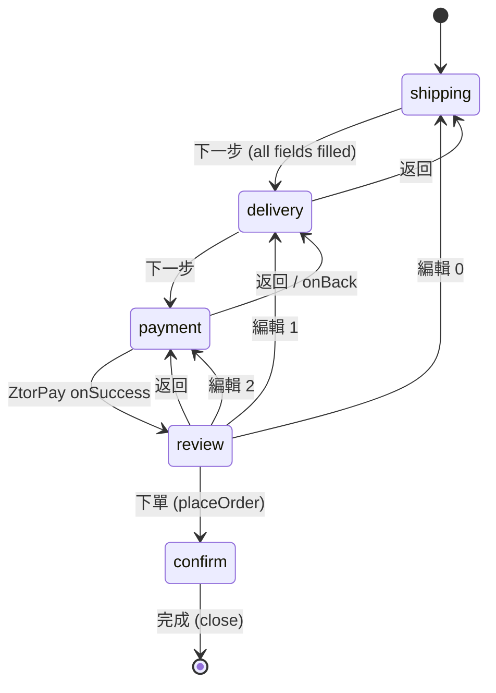
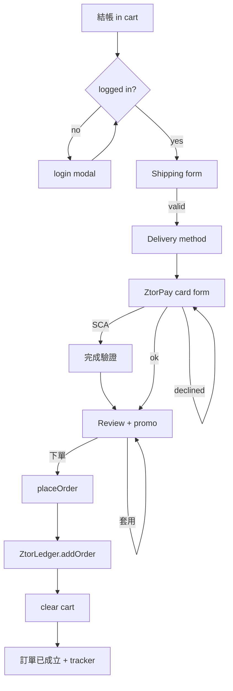

# Checkout (multi-step)

> A 4-step checkout stepper inside the cart drawer (address → delivery → payment → review) that computes discount, tax, shipping and total, takes a mock card payment, persists a paid order to localStorage, and shows a confirmation with an order tracker.

## Human Overview

### What this feature does

- Logged-in fans complete a goods/bundle purchase after pressing 結帳 (Checkout) in the cart drawer.
- A single right-side drawer hosts a 4-step wizard: 收件資訊 (contact + address) → 配送方式 (delivery method) → 付款 (card payment) → 確認訂單 (review + promo).
- On 下單 (Place order) the app computes the final total, records a `paid` order, clears the cart, and shows 訂單已成立 with an order ID and a 4-stage tracker (已下單 → 備貨中 → 已出貨 → 已送達).
- It becomes available the moment the cart has at least one line item and the user is logged in.
- Business value: closes the shop revenue loop end-to-end as a demo — every money number is computed in front-end code; nothing is charged.

### Approach in one line

Reuse the one mock-payment module (`ZtorPay`) and persist to localStorage (`ZtorLedger`); compute all money client-side with `Math.round`; no real charge, no real order API (`assets/checkout.js`, `HANDOFF.md` SHOP section).

### The math, in plain numbers ⚠️ READ TO VALIDATE

**Constants**

- Standard shipping = **NT$120**, ETA 3–5 工作天 (`checkout.js:22`).
- Express shipping = **NT$220**, ETA 1–2 工作天 (`checkout.js:23`).
- Free shipping when subtotal **≥ NT$3,000** (`FREE_SHIP_OVER`, `checkout.js:25`).
- Tax rate = **5%** = 0.05 (`TAX_RATE`, `checkout.js:26`).
- Promo codes (case-insensitive; input upper-cased) (`checkout.js:27`, `:276`):
  - `ZTOR10` → **10% off** (kind `pct`, 0.10).
  - `WELCOME50` → **NT$50 flat off** (kind `flat`).
  - `FREESHIP` → **free shipping** (kind `ship`).

**Formulas** (subtotal = Σ price×qty of cart lines, from `ZtorCart.subtotal()`)

- `discount` (`checkout.js:58`):
  - pct → `Math.round(subtotal × val)`
  - flat → `Math.min(subtotal, val)`  ← never exceeds subtotal
  - ship → `0`
- `shipFee` (`checkout.js:52`):
  - `0` if promo is FREESHIP-kind **OR** subtotal ≥ 3000
  - else the selected method's fee (120 or 220)
- `tax` (`checkout.js:64`) = `Math.round((subtotal − discount) × 0.05)`  ← computed **after** discount, **before** shipping
- `total` (`checkout.js:65`) = `Math.max(0, subtotal − discount) + shipFee + tax`  ← floored at 0 before adding ship + tax
- `orderId` (`ztor-ledger.js:31–34`) = `ZT` + `YYMMDD` + `-` + random integer 1000–9999 (e.g. `ZT260625-4821`).

**Ordering rule:** discount first → tax on the discounted subtotal → shipping decided independently of discount (except FREESHIP) → sum. Rounding is `Math.round` (half-up) at each of discount(pct) and tax.

**Worked example 1 — promo + flat shipping** (the canonical case)

> subtotal NT$2,000, method = standard (120), promo = `ZTOR10` (10%)
> - discount = round(2000 × 0.10) = **NT$200**
> - taxable = 2000 − 200 = 1800
> - tax = round(1800 × 0.05) = **NT$90**
> - ship: subtotal 2000 < 3000 → standard fee **NT$120**
> - total = max(0, 1800) + 120 + 90 = **NT$2,010** ✓

**Worked example 2 — crossing the free-ship threshold, no promo**

> subtotal NT$3,500, no promo
> - discount = **0**
> - tax = round(3500 × 0.05) = **NT$175**
> - ship: subtotal 3500 ≥ 3000 → **免運 (0)**
> - total = 3500 + 0 + 175 = **NT$3,675** ✓

**Worked example 3 — `FREESHIP` promo** (zeros shipping, no money discount)

> subtotal NT$1,200, method = express (220), promo = `FREESHIP`
> - discount = 0 (ship-kind contributes no money discount, `checkout.js:62`)
> - tax = round(1200 × 0.05) = **NT$60**
> - ship: promo kind is `ship` → **0** (overrides the 220 method fee, `checkout.js:53`)
> - total = 1200 + 0 + 60 = **NT$1,260** ✓

**Worked example 4 — `WELCOME50` flat off**

> subtotal NT$800, method = standard (120), promo = `WELCOME50`
> - discount = min(800, 50) = **NT$50**
> - taxable = 800 − 50 = 750
> - tax = round(750 × 0.05) = **NT$38** (37.5 → 38, half-up)
> - ship: 800 < 3000 → **NT$120**
> - total = 750 + 120 + 38 = **NT$908** ✓

**Edge cases**

- Flat discount can never exceed subtotal — `Math.min(subtotal, val)` (`checkout.js:61`). E.g. WELCOME50 on a NT$30 subtotal → discount 30, not 50.
- `total` is floored at 0 on the goods portion via `Math.max(0, subtotal − discount)`, then ship + tax are added (`checkout.js:65`). Ship + tax are themselves ≥ 0, so total ≥ 0.
- Tax is on the **discounted** subtotal, never on shipping (`checkout.js:64`).
- Pre-delivery summary (step 1) shows ship/tax as **TBD** and the total as the bare subtotal, because no method is chosen yet (`checkout.js:88–90`, `summaryHtml({preDelivery:true})`).

### Feature at a glance

| Item | Details |
| --- | --- |
| Feature ID | SHOP-006 |
| Domain | shop |
| Primary users | Fan (logged-in) |
| Implementation status | implemented |
| Confidence | high |
| Main routes | `shop.html`, `shop-item.html` (any page with the cart drawer) |
| Main result | A paid order persisted to localStorage + a confirmation screen with order ID and tracker |
| Real vs mock | Real: the stepper UI, all money math, validation. Mock: payment (`ZtorPay` test cards), login gate (`body[data-auth]`), persistence (localStorage via `ZtorLedger`). No real charge / order API. |

### User-visible states

| State | Meaning | What the user sees | Available action |
| --- | --- | --- | --- |
| Shipping (step 1) | Entering contact + address | Form (收件人/手機/郵遞區號/配送地址) + pre-delivery summary (ship/tax = TBD) | 下一步：配送方式 |
| Delivery (step 2) | Choosing method | Two radio cards: 標準宅配 NT$120 / 快遞急件 NT$220 (or 免運 if ≥3000) + live summary | Select method · 下一步：付款 · 返回 |
| Payment (step 3) | Entering card | `ZtorPay` card form, amount = current total | 確認付款 · 返回 (handled by ZtorPay) |
| Review (step 4) | Confirm + promo | Review blocks (收件/配送/付款) + promo input + itemized summary | 套用/移除 promo · 編輯 each block · 下單 · 返回 |
| Confirm (terminal) | Order placed | ✓ 訂單已成立 + order number + tracker (已下單 current) | 查看我的訂單 · 完成 |

### Main actions

| Action | Who | When it appears | Result |
| --- | --- | --- | --- |
| 下一步 (Next) | Fan | Steps 1–2 | Validates (step 1 only) then advances |
| 返回 (Back) | Fan | Steps 2–4 | Goes back one step |
| 套用 (Apply promo) | Fan | Review step | Applies a valid code; recomputes totals |
| 移除 (Remove promo) | Fan | Review step, promo active | Clears promo; recomputes |
| 編輯 (Edit) | Fan | Review step | Jumps back to the chosen step (0/1/2) |
| 下單 (Place order) | Fan | Review step | Persists order, clears cart, shows confirmation |
| 完成 (Done) | Fan | Confirmation | Closes the drawer |

### Important business rules

- **Checkout is login-gated.** Pressing 結帳 in the cart routes through `ZtorAuth.requireLogin` before the stepper opens (`cart.js:500`); logged-out users see the login modal first.
- **Tax is computed after discount, before shipping** (`checkout.js:64`).
- **Free shipping** is automatic at subtotal ≥ NT$3,000, independent of any promo (`checkout.js:55`).
- **FREESHIP** zeroes shipping but gives no money discount (`checkout.js:53,62`).
- **Flat discount is capped at the subtotal** (`checkout.js:61`).
- **Address is required**; step 1 blocks 下一步 until all four fields are filled (`checkout.js:264–267`).
- **An SCA card still completes** the order — the order is recorded with that card's last4 (`mock-pay.js:89`, `checkout.js:146`).

### Related features

- [Mock Card Payment (ZtorPay)](../payments/mock-payment.md) — PAY-001, the payment step.
- [Promo / Discount Codes](../payments/promo-codes.md) — PAY-002, the discount math.
- [Shopping Cart](../shop/shopping-cart.md) — SHOP-004, the source of items + subtotal.
- [Login Gate](../authentication/auth-gate.md) — gates 結帳.
- [My Orders](../orders/my-orders.md) — where the placed order surfaces.

### Known gaps or uncertainties

- Payment is mock (`ZtorPay` test-card outcomes), not Stripe (`HANDOFF.md`, "Backend stubs").
- The order is persisted only to localStorage; there is no real order/inventory API (`HANDOFF.md`).
- Promo codes are a hardcoded client map — no validation service (`HANDOFF.md`).
- The order tracker is static (always shows 已下單 as current); no real fulfilment progression.
- `cart.js` contains an older inline single-screen checkout mock (`cart.js:369–486`) that is **dead** whenever `checkout.js` is loaded — `renderCheckout` delegates to `ZtorCheckout.mount` first (`cart.js:373`). Documented here as a known divergence (see Section 16).

---

# AI and Engineering Specification

## 1. Canonical metadata

```yaml
feature:
  id: SHOP-006
  name: Checkout (multi-step)
  slug: checkout
  domain: shop
  status: implemented
  confidence: high
  actors: [fan]
  routes: ["shop.html", "shop-item.html"]
  permissions: ["logged-in"]
  featureFlags: []
  relatedFeatures: ["SHOP-004", "PAY-001", "PAY-002"]
  sourceFiles:
    - assets/checkout.js
    - assets/cart.js
    - assets/mock-pay.js
    - assets/ztor-ledger.js
  lastAuditedAt: "2026-06-25"
```

## 2. Source-code evidence

| Type | File | Symbol or line | Evidence |
| --- | --- | --- | --- |
| Service | `assets/checkout.js` | `window.ZtorCheckout = { mount }` `:286` | Public mount API the cart delegates to |
| Data | `assets/checkout.js` | `SHIP_METHODS` `:21–24` | standard 120 / express 220 + ETAs |
| Data | `assets/checkout.js` | `FREE_SHIP_OVER = 3000` `:25` | Free-ship threshold |
| Data | `assets/checkout.js` | `TAX_RATE = 0.05` `:26` | 5% tax |
| Data | `assets/checkout.js` | `PROMOS` `:27–31` | ZTOR10 / WELCOME50 / FREESHIP |
| Render | `assets/checkout.js` | `STEPS` `:33`, `render()` `:224` | shipping→delivery→payment→review dispatch |
| Calc | `assets/checkout.js` | `shipFee` `:52`, `discount` `:58`, `tax` `:64`, `total` `:65` | All money math |
| State | `assets/checkout.js` | `state` `:41–47` | step/shipping/method/payment/promo |
| Render | `assets/checkout.js` | `renderPayment` `:137–153` | Mounts `ZtorPay.open` with `amount: total()` |
| Service | `assets/checkout.js` | `placeOrder` `:207–221` | Builds order object, calls `ZtorLedger.addOrder`, clears cart |
| Render | `assets/checkout.js` | `renderConfirm` `:185–204` | Order id + 4-node tracker |
| Action | `assets/checkout.js` | `onNext` `:261–271` | Step-1 required-field validation |
| Action | `assets/checkout.js` | `applyPromo` `:273–281` | Upper-case lookup in PROMOS |
| Page | `assets/cart.js` | `renderCheckout` `:369–383` | Delegates to `ZtorCheckout.mount` |
| Gate | `assets/cart.js` | `[data-cart-checkout]` handler `:499–503` | `ZtorAuth.requireLogin` before checkout |
| Service | `assets/ztor-ledger.js` | `addOrder` `:39–42`, `genId` `:31–35` | Order persistence + ID format |

## 3. Actors and permissions

| Actor | Permission or role | Allowed actions | Restricted actions |
| --- | --- | --- | --- |
| Guest | not authenticated | Open cart, edit cart, press 結帳 (→ login modal) | Cannot enter the stepper until login (`cart.js:500`) |
| Fan (logged-in) | mock `body[data-auth]='logged-in'` | Full checkout: address, method, pay, promo, place order | — |

## 4. State model

| State ID | State name | Entry condition | Exit condition | Next possible states |
| --- | --- | --- | --- | --- |
| S0 | shipping | Stepper mounted (`step=0`) | All 4 fields filled + 下一步 | delivery |
| S1 | delivery | 下一步 from shipping | 下一步 (→payment) / 返回 (→shipping) | payment, shipping |
| S2 | payment | 下一步 from delivery | ZtorPay onSuccess (→review) / onBack (→delivery) | review, delivery |
| S3 | review | Payment success, or 編輯 jump | 下單 (→confirm) / 返回 (→payment) / 編輯 (→S0/S1/S2) | confirm, payment, shipping, delivery |
| S4 | confirm | placeOrder succeeded | 完成 closes drawer | (terminal) |

Default state: S0. Terminal state: S4. Transitions are user-driven except S2→S3 which is triggered by the ZtorPay payment success callback (`checkout.js:146`).



## 5. Action visibility and availability matrix

| Action ID | Label (actual copy) | UI location | Actor | Required state | Conditions | Hidden when | Disabled when | Result |
| --- | --- | --- | --- | --- | --- | --- | --- | --- |
| A1 | 下一步：配送方式 | step-1 footer | Fan | shipping | — | not shipping | — | Validate + advance (`checkout.js:116,261`) |
| A2 | 下一步：付款 | step-2 footer | Fan | delivery | — | not delivery | — | Advance to payment (`checkout.js:133`) |
| A3 | 返回 | step 2–4 footer | Fan | delivery/payment/review | — | step 1 | — | Back one step (`checkout.js:134,182,236`) |
| A4 | 標準宅配 / 快遞急件 | step-2 method cards | Fan | delivery | — | other steps | — | Set method, recompute (`checkout.js:251`) |
| A5 | 套用 | review promo row | Fan | review | no promo active | promo active | — | Apply code (`checkout.js:175,273`) |
| A6 | 移除 | review promo row | Fan | review | promo active | no promo | — | Clear promo (`checkout.js:174,240`) |
| A7 | 編輯 | review blocks | Fan | review | — | other steps | — | Jump to step 0/1/2 (`checkout.js:162,250`) |
| A8 | 下單 · NT$… | review footer | Fan | review | — | other steps | self-disables on click → 處理中… (`checkout.js:254`) | placeOrder (`checkout.js:181,207`) |
| A9 | 完成 | confirm footer | Fan | confirm | — | other steps | — | Close drawer (`checkout.js:203,242`) |
| A10 | 查看我的訂單 | confirm footer | Fan | confirm | — | other steps | — | Link to `my-library.html#orders` (`checkout.js:202`) |

## 6. Functional requirements

| Requirement ID | Requirement | Evidence | Status |
| --- | --- | --- | --- |
| SHOP-006-FR-001 | The system shall present a 4-step stepper: shipping → delivery → payment → review | `checkout.js:33,224` | Implemented |
| SHOP-006-FR-002 | The system shall require all four shipping fields before advancing from step 1 | `checkout.js:264–267` | Implemented |
| SHOP-006-FR-003 | The system shall offer standard (NT$120) and express (NT$220) delivery | `checkout.js:21–24` | Implemented |
| SHOP-006-FR-004 | The system shall waive shipping when subtotal ≥ NT$3,000 | `checkout.js:55` | Implemented |
| SHOP-006-FR-005 | The system shall compute discount per promo kind (pct/flat/ship) | `checkout.js:58–63` | Implemented |
| SHOP-006-FR-006 | The system shall compute tax = round((subtotal − discount) × 0.05) | `checkout.js:64` | Implemented |
| SHOP-006-FR-007 | The system shall compute total = max(0, subtotal − discount) + shipFee + tax | `checkout.js:65` | Implemented |
| SHOP-006-FR-008 | The system shall take payment via ZtorPay with amount = current total | `checkout.js:142–146` | Implemented |
| SHOP-006-FR-009 | The system shall persist a `paid` order via ZtorLedger.addOrder on place-order | `checkout.js:218`, `ztor-ledger.js:39` | Implemented |
| SHOP-006-FR-010 | The system shall clear the cart after placing the order | `checkout.js:219` | Implemented |
| SHOP-006-FR-011 | The system shall show a confirmation with order ID and a 4-stage tracker | `checkout.js:185–204` | Implemented |
| SHOP-006-FR-012 | The system shall reject invalid promo codes with an inline error | `checkout.js:278` | Implemented |
| SHOP-006-FR-013 | The system shall gate entry to checkout behind login | `cart.js:500` | Implemented |

## 7. User scenarios

```text
Scenario ID: SHOP-006-UC-001
Name: Happy-path goods checkout with promo
Actor: Fan (logged-in)
Preconditions: Cart has ≥1 line; subtotal NT$2,000
Trigger: Press 結帳 in cart drawer
Main flow:
  1. Stepper opens at shipping; fan fills 收件人/手機/郵遞區號/配送地址; 下一步
  2. Delivery: selects 標準宅配 (NT$120); 下一步
  3. Payment: enters a valid test card; 確認付款 → ZtorPay onSuccess
  4. Review: enters ZTOR10, 套用 → discount NT$200, tax NT$90, total NT$2,010
  5. 下單 → order recorded, cart cleared, confirmation shown
Alternative flows:
  - 編輯 from review jumps back to any prior step
Error flows:
  - Empty address field → "請填寫所有收件欄位。" (step blocked)
  - Card ending 0002 → declined inline; stays on payment step
  - Invalid promo → "折扣碼無效，請重新輸入。"
Final state: Paid order in ZtorLedger; cart empty; tracker at 已下單
Related requirements: FR-001..FR-013
```

```text
Scenario ID: SHOP-006-UC-002
Name: SCA / 3DS card completes the order
Actor: Fan (logged-in)
Preconditions: Cart has ≥1 line
Trigger: At payment, enter card ending 3220 (or 3155)
Main flow:
  1. ZtorPay shows the 3D-Secure callout; fan presses 完成驗證
  2. onSuccess fires with outcome 'sca'; stepper advances to review
  3. 下單 records order with that card's last4
Final state: Paid order recorded
Related requirements: FR-008, FR-009
```

```text
Scenario ID: SHOP-006-UC-003
Name: Logged-out fan blocked at checkout
Actor: Guest
Preconditions: Cart has ≥1 line; body[data-auth] != logged-in
Trigger: Press 結帳
Main flow:
  1. ZtorAuth.requireLogin opens the login modal with reason 登入後即可結帳
  2. On mock login (auth:login), the pending action resumes → stepper opens
Final state: Stepper at shipping (post-login) OR cancelled (modal closed)
Related requirements: FR-013
```

## 8. User-flow diagrams



## 9. Data model

The order object built in `placeOrder` (`checkout.js:209–217`) and persisted by `ZtorLedger.addOrder` (`ztor-ledger.js:39`):

| Entity / object | Field | Type | Required | Source | Meaning |
| --- | --- | --- | --- | --- | --- |
| order | id | string | yes (added by ledger) | `ztor-ledger.js:40` | `ZT<YYMMDD>-<1000–9999>` |
| order | type | string `'goods'` | yes | `checkout.js:210` | Order type discriminator |
| order | currency | string | yes | `checkout.js:211` | From `store.currency()` (e.g. NT$) |
| order | items | array | yes | `checkout.js:212` | `{id,title,price,qty,image}` per line |
| order | shipping | object | yes | `checkout.js:213` | `{name,phone,zip,addr,method}` |
| order | payment | object | yes | `checkout.js:214` | `{last4, method:'card'}` |
| order | subtotal | number | yes | `checkout.js:215` | Σ price×qty |
| order | discount | number | yes | `checkout.js:215` | Computed discount |
| order | ship | number | yes | `checkout.js:215` | Final shipping fee |
| order | tax | number | yes | `checkout.js:215` | Computed tax |
| order | promo | string\|null | yes | `checkout.js:216` | Applied promo label or null |
| order | total | number | yes | `checkout.js:216` | Final total |
| order | status | string `'paid'` | yes | `checkout.js:216` | Always paid on place |
| order | ts | number | yes (added by ledger) | `ztor-ledger.js:40` | Epoch ms timestamp |

Persisted to `localStorage['ztor_orders_v1']`, newest first (`ztor-ledger.js:29,17`).

## 10. API and service behaviour

No server. The client "services":

| Method | Function | Purpose | Request | Response | Errors | Called by |
| --- | --- | --- | --- | --- | --- | --- |
| `ZtorCheckout.mount(ctx)` | `checkout.js:36` | Render the stepper into the drawer's checkout view | `{root,body,foot,store,close,back}` | — (renders) | — | `cart.js:373` |
| `ZtorPay.open(o)` | `mock-pay.js:99` | Card form for the payment step | `{mount,amount,currency,title,confirmLabel,backLabel,onSuccess,onFail,onBack}` | callbacks | declined / sca handled inline | `checkout.js:142` |
| `ZtorLedger.addOrder(o)` | `ztor-ledger.js:39` | Persist the order | order object | record w/ id + ts | none (try/catch swallow) | `checkout.js:218` |
| `ZtorCart.subtotal()` / `.getItems()` / `.currency()` / `.clear()` | `cart.js:86,83,87,111` | Read items + clear cart | — | numbers/array | none | `checkout.js:50,79,84,219` |
| `ZtorAuth.requireLogin(fn, reason)` | (auth.js) | Gate checkout entry | callback + reason | resumes on login | none | `cart.js:500` |

Real backend stubs these replace: real Stripe (ZtorPay), real order/inventory API (ZtorLedger.addOrder), promo-validation service (PROMOS map) — `HANDOFF.md` "Backend stubs → real later".

## 11. Calculations and formulas

| Calc ID | Name | Formula | Inputs | Rounding | Unit | Source |
| --- | --- | --- | --- | --- | --- | --- |
| C1 | discount (pct) | `Math.round(subtotal × val)` | subtotal, val=0.10 | half-up | NT$ | `checkout.js:60` |
| C2 | discount (flat) | `Math.min(subtotal, val)` | subtotal, val=50 | none | NT$ | `checkout.js:61` |
| C3 | discount (ship) | `0` | — | none | NT$ | `checkout.js:62` |
| C4 | shipFee | `(promo.kind==='ship' \|\| subtotal≥3000) ? 0 : methodFee` | subtotal, method, promo | none | NT$ | `checkout.js:52–56` |
| C5 | tax | `Math.round((subtotal − discount) × 0.05)` | subtotal, discount | half-up | NT$ | `checkout.js:64` |
| C6 | total | `Math.max(0, subtotal − discount) + shipFee + tax` | all above | none | NT$ | `checkout.js:65` |
| C7 | orderId | `'ZT' + YYMMDD + '-' + (1000..9999)` | date, random | — | string | `ztor-ledger.js:31–34` |

Notes:
- **Min/max:** flat discount min'd to subtotal (C2); total floored at 0 on goods portion (C6).
- **Precision:** integer NT$ throughout; `Math.round` applied at C1 and C5 only.
- **Null behaviour:** no promo → discount 0, shipFee uses method (C4); empty cart → subtotal 0 (`cart.js:86`), but checkout is unreachable with an empty cart (CTA disabled, `cart.js:364`).
- **Division-by-zero:** none (no division).
- **Inclusion/exclusion:** tax includes discount, excludes shipping; total includes ship + tax.
- **Conflict:** `cart.js`'s dead inline checkout computes `tax = round(subtotal × 0.05)` on the **undiscounted** subtotal and has no promo (`cart.js:388`). This path is bypassed when `checkout.js` is present (`cart.js:373`). The authoritative tax is `checkout.js:64`.

## 12. Notifications and side effects

| Trigger | Recipient | Channel | Message / event | Source |
| --- | --- | --- | --- | --- |
| placeOrder | self | DOM event | `ledger:change` `{kind:'order', id}` | `ztor-ledger.js:41` |
| placeOrder | localStorage | persistence | order pushed to `ztor_orders_v1` | `ztor-ledger.js:29` |
| placeOrder | cart store | DOM event | `cart:change` `{type:'clear'}` (badge + drawer reset) | `cart.js:111,219` |
| Confirmation copy | Fan | UI text | 確認信將寄送到你的信箱 (no real email) | `checkout.js:193` |

## 13. Error and edge-case handling

| Condition | Current system behaviour | User-visible result | Recovery |
| --- | --- | --- | --- |
| Empty shipping field | `onNext` aborts | "請填寫所有收件欄位。" inline | Fill fields, retry |
| Card ending 0002 | `outcome='declined'`, onFail | "卡片遭拒…(測試：卡號尾數 0002)" | Use another card |
| Card ending 3220/3155 | SCA screen | 3D-Secure callout → 完成驗證 → success | Complete verification |
| Card < 12 digits / bad exp / short cvc | `validate` returns msg | Inline field error | Correct fields |
| Invalid promo | `applyPromo` aborts | "折扣碼無效，請重新輸入。" | Enter a valid code |
| Logged out at 結帳 | requireLogin gate | Login modal | Log in → resume |
| ZtorPay not loaded | fallback message | "付款模組未載入。" | (dev-only) load mock-pay.js |
| ZtorLedger missing | `placeOrder` uses fallback id `ZT-MOCK` | Confirmation still shows | (dev-only) load ledger |

## 14. Acceptance criteria

```gherkin
Feature: Checkout (multi-step)

  Scenario: Promo + standard shipping totals correctly
    Given a logged-in fan with a cart subtotal of NT$2,000
    And the selected delivery method is standard
    When the fan applies promo code "ZTOR10"
    Then the discount is NT$200
    And the tax is NT$90
    And the shipping is NT$120
    And the order total is NT$2,010

  Scenario: Free shipping above threshold
    Given a logged-in fan with a cart subtotal of NT$3,500 and no promo
    When the fan reaches the review step
    Then the shipping shows 免運
    And the tax is NT$175
    And the order total is NT$3,675

  Scenario: FREESHIP zeroes shipping only
    Given a cart subtotal of NT$1,200 with express selected
    When the fan applies "FREESHIP"
    Then the discount is NT$0
    And the shipping is NT$0
    And the tax is NT$60
    And the total is NT$1,260

  Scenario: Declined card keeps the fan on payment
    Given the fan is on the payment step
    When the fan submits a card ending in 0002
    Then an inline decline error is shown
    And the stepper stays on the payment step

  Scenario: Placing the order clears the cart
    Given a valid payment on the review step
    When the fan presses 下單
    Then a paid order is recorded in ZtorLedger
    And the cart becomes empty
    And a confirmation with an order number is shown
```

## 15. Dependencies and relationships

- **Parent feature:** [Shopping Cart](../shop/shopping-cart.md) (SHOP-004) — provides items + subtotal + the drawer surface.
- **Child features:** none.
- **Shared services:** `window.ZtorPay`, `window.ZtorLedger`, `window.ZtorAuth`, `window.ZtorCart`.
- **Shared components:** the cart drawer (`cart.js`), `.cc-pay`/`.cc-field` form classes, `47-checkout.css` (stepper/methods/review/promo/tracker).
- **Events emitted / consumed:** emits `ledger:change`, `cart:change` (via clear); consumes `auth:login` (via the gate's resume).
- **Config / data dependencies:** `SHIP_METHODS`, `FREE_SHIP_OVER`, `TAX_RATE`, `PROMOS` (all in `checkout.js`).

## 16. Open questions and implementation gaps

### Confirmed implementation gaps

- Payment is mock (test cards), not Stripe — `HANDOFF.md` "Backend stubs → real later".
- Order persistence is localStorage only; no order/inventory API.
- Promo codes are a hardcoded map; no validation service.
- Order tracker is static (always 已下單 current); no fulfilment state machine.
- "確認信將寄送到你的信箱" is copy only — no email sent.

### Conflicting implementations

- `cart.js:369–486` contains a legacy single-screen checkout (Apple Pay / 貨到付款 radios, tax on undiscounted subtotal) that is **superseded** by `checkout.js` via the `cart.js:373` delegation guard. It only runs if `window.ZtorCheckout` is absent. Recommend removing the dead branch to avoid drift.

### Unresolved questions

- Q: Should tax apply when FREESHIP is used on a high subtotal that also crosses free-ship? — It does; tax is independent of shipping (`checkout.js:64`). Owner: business/finance. Blocks confidence: no.
- Q: Should `ship` value stored in the order equal the displayed fee when subtotal ≥ 3000? — Yes, it stores 0 (`checkout.js:215` calls `shipFee()`). Owner: backend. Blocks confidence: no.
- Q: Currency mixing — cart `currency()` returns the first line's currency (`cart.js:87`); a mixed-currency cart would mislabel totals. Owner: product/frontend. Blocks confidence: no (mock data is single-currency).
