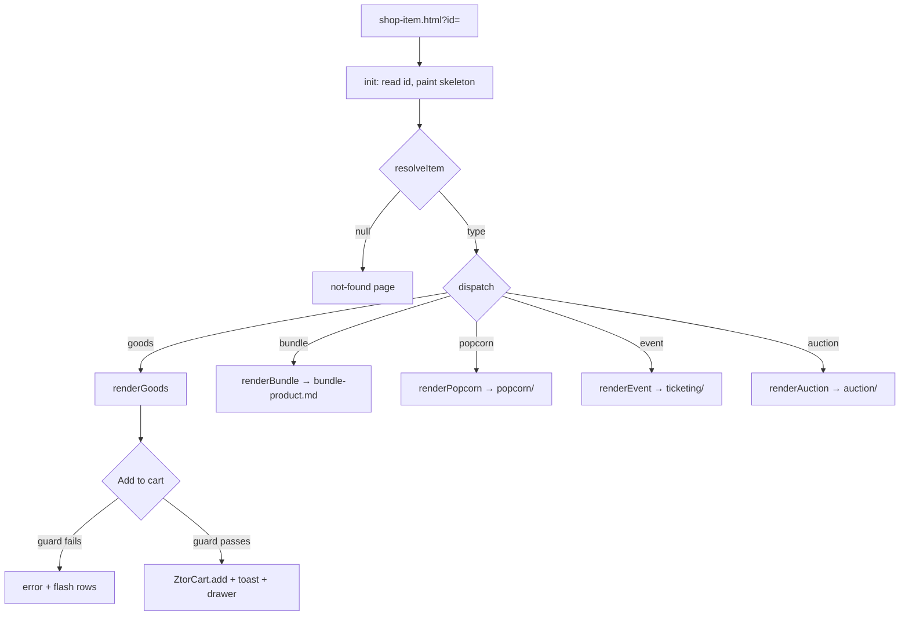

# Product Detail Page (Goods)

> The single PDP renderer that turns a `?id=` into a type-correct detail page — gallery + zoom, variant selection with a select-guard, quantity, wishlist, disclosures, and a related rail — and dispatches the four non-goods types (bundle / popcorn / event / auction) through the same shell.

## Human Overview

### What this feature does

- The **detail page** for one shop item. The user reaches it by tapping any PLP card (`shop-item.html?id=<id>`).
- One module (`shop-detail-render.js`) resolves the id, figures out the item **type**, and renders the matching layout into `#pdpRoot`.
- For standard **goods** the page shows: an image gallery (thumb-swap + fullscreen zoom + a placeholder video tile), the price, **variant chips** (size / colour) with sold-out options shown disabled, a **quantity** stepper, an **Add to cart** button, a **wishlist** toggle, collapsible **disclosures** (description / specs / shipping & returns), and a **"你可能也喜歡" related rail**.
- A **select-guard** blocks Add to cart until every variant row has a choice; an inline error prompts the user and the unchosen rows flash.
- On mobile a **sticky buy-bar** appears once the inline Add button scrolls out of view.
- The same shell renders **bundle, popcorn, event, and auction** items — the buy column swaps for type-specific content, and their *transactions* live in other feature docs (linked below).
- Available to everyone; no login to view. Add-to-cart writes to the localStorage cart.

### Approach in one line

A param-driven renderer resolves the item across all PLP arrays, merges the optional `detail[id]` sidecar over it, and renders one of five buy-columns into a shared gallery+disclosures+related shell — reusing `ZtorCart` for the goods add path.

### The math, in plain numbers ⚠️ READ TO VALIDATE

**No money math on the goods PDP — display + selection logic only.** The two load-bearing rules, stated precisely:

**1. Variant select-guard** (`shop-detail-render.js:562-566, 587-596`). Add to cart is allowed only when **every** variant row has a pick:

```
allPicked() = for each row vi in item.variants: picks[vi] must be set
doAdd():  IF NOT allPicked()  → show [data-guard] error, flash each unpicked .pdp-variant, ABORT
          ELSE                → ZtorCart.add({ id: <id>|<v1-v2…>, title: name（v1 / v2）, price: ntd, qty })
```

- Sold-out options render `disabled aria-disabled="true"` and carry a 售完 badge (`:126-129`); a disabled chip cannot be picked (`:493` checks `!chip.hasAttribute('disabled')`), so it can never satisfy the guard.
- The cart **line id** appends the chosen values so the same product in two sizes is two cart lines: `lineId = id + '|' + values.join('-')` (`:598`); the title appends the human labels: `name（M / 墨黑）` (`:599`).
- Worked example: tee with size {S,M,L,XL-soldOut} + colour {墨黑,霧灰}. User picks M + 墨黑 → `allPicked()` true → line id `ztor-logo-heavyweight-tee-black|m-black`, title `…重磅 T 恤（墨黑）（M / 墨黑）`, qty as set, price NT$880. Picking only M → guard error "請先選擇尺寸", colour row flashes, no add.

**2. Image fallback chain (PDP gallery)** (`shop-detail-render.js:31-38`):

```
gallerySources(id, detail) =
  IF detail.images.length  → detail.images mapped to "assets/images/shop/g/<file>"
  ELSE IF imgMap[id]        → ["assets/images/shop/g/" + imgMap[id]]
  ELSE                      → [ "https://picsum.photos/seed/<id>/900/1200" ]
```

Plus the same runtime `onerror` → gradient-tile tier on every `` (`:28`). So: **detail.images → imgMap → picsum → gradient tile.** This is the PDP analogue of the PLP chain in [browse-shop.md](./browse-shop.md), just sourced from the richer `detail.images[]` array first.

Source for each number in parentheses.

### Feature at a glance

| Item | Details |
| --- | --- |
| Feature ID | SHOP-002 |
| Domain | shop |
| Primary users | Guest, Fan |
| Implementation status | implemented |
| Confidence | high |
| Main routes | `shop-item.html?id=<id>` |
| Main result | The user inspects a product, picks variants, and adds it to cart — or proceeds to the type-specific transaction (bundle/popcorn/event/auction) |
| Real vs mock | Real: rendering, gallery/zoom, variant guard, qty, cart add. Mock: wishlist (no persist on PDP), imagery placeholders; type CTAs that lack their sheet show a "即將推出" toast |

### User-visible states

| State | Meaning | What the user sees | Available action |
| --- | --- | --- | --- |
| Loading | id resolving | PDP skeleton (hero + buy lines) | Wait |
| Not found | id missing / unknown | "找不到這件商品" + 回商店逛逛 | Return to shop |
| Goods — variants unselected | Variants exist, none picked | Chips at rest; Add enabled but guarded | Pick variant |
| Goods — variant selected | At least one row chosen | Selected chip highlighted | Pick remaining · Add |
| Goods — guard tripped | Add tapped with a row unpicked | Inline error + flashing rows | Pick the missing row |
| Sold-out option | `soldOut:true` on an option | Disabled chip + 售完 | Pick another option |
| Sold-out item | `item.soldOut` | "已售完" disabled Add button | View only / wishlist |
| Wishlist on/off | Heart toggled | aria-pressed flip + label swap + toast | Toggle |

### Main actions

| Action | Who | When | Result |
| --- | --- | --- | --- |
| Thumb swap | Guest/Fan | Gallery has >1 image | Hero image swaps |
| Open zoom | Guest/Fan | Click hero frame | Fullscreen `DSZoom` lightbox |
| Pick variant | Guest/Fan | Goods/bundle with variants | Records pick, clears guard |
| Qty − / + | Guest/Fan | Goods/event | qty 1–99 |
| Add to cart | Guest/Fan | Goods/bundle, not sold-out | Guard check → `ZtorCart.add` + toast + open drawer |
| Wishlist | Guest/Fan | Always | DOM toggle + toast |
| Type CTA | Guest/Fan | popcorn/event/auction | Opens that type's sheet or stub toast |

### Important business rules

- **One resolver, five layouts.** `resolveItem(id)` searches `products ∪ popcornItems ∪ shopEvents ∪ auctions ∪ creators[].products`, merges `detail[id]` over the base, and tags `type` (`shop-detail-render.js:60-83`).
- **Detail merges OVER base** — every `detail[id]` field is optional + additive (`:75-76`, HANDOFF data model).
- **Variant guard** — see math. Sold-out options are non-selectable.
- **Bundle adds as ONE line** — see [bundle-product.md](./bundle-product.md).
- **Mobile buy-bar reveals on scroll** via `IntersectionObserver` on the inline Add (`:615-624`).
- **Type CTAs degrade gracefully** — if the type's sheet module isn't present, a labelled toast appears, never a dead control (`:531-540`).

### Related features

- [Browse Shop](./browse-shop.md) — the PLP that links here
- [Bundle Product (套組)](./bundle-product.md) — bundle variant of this renderer
- [Quick Add to Cart](./quick-add.md) · [Wishlist / Save Item](./wishlist.md)
- [Shopping Cart](./shopping-cart.md) · [Checkout](./checkout.md) · [Mock Payment](../payments/mock-payment.md)
- Type transactions: [Ticketing](../ticketing/) · [Auction](../auction/) · [Popcorn](../popcorn/)

### Known gaps or uncertainties

- Imagery is archetype WebP placeholders (HANDOFF).
- The **video gallery tile is a placeholder** — clicking it toasts "商品影片即將推出" (`:464`); no real clip.
- PDP wishlist is a **local DOM toggle with no persistence** (`:510-517`) — distinct from the persistent auth-gated save (see [wishlist.md](./wishlist.md)).
- Popcorn/event/auction CTAs render but their completion flows are separate features; absent sheet modules fall back to toasts.

---

# AI and Engineering Specification

## 1. Canonical metadata

```yaml
feature:
  id: SHOP-002
  name: Product Detail Page (Goods)
  slug: product-detail
  domain: shop
  status: implemented
  confidence: high
  actors: [guest, fan]
  routes: [shop-item.html]
  permissions: []
  featureFlags: []
  relatedFeatures: [SHOP-001, SHOP-003, SHOP-005, SHOP-007]
  sourceFiles:
    - assets/shop-detail-render.js
    - assets/shop-data-detail.js
    - assets/shop-data-products.js
    - assets/shop-data-imgmap.js
    - shop-item.html
  lastAuditedAt: "2026-06-25"
```

## 2. Source-code evidence

| Type | File | Symbol or line | Evidence |
| --- | --- | --- | --- |
| Page | `shop-item.html` | `#pdpRoot` `:507`; data+render scripts `:720-739` | PDP mount + load order |
| Resolve | `assets/shop-detail-render.js` | `resolveItem` `:60-83` | id → {item, detail, type, id} across all arrays |
| Type tag | same | `:78-81` | popcorn/event/auction/bundle classification |
| Image | same | `gallerySources` `:31-38` | detail.images → imgMap → picsum |
| Render | same | `galleryHtml` `:98-118` | Thumbs + hero frame + zoom + video tile |
| Render | same | `variantsHtml` `:121-136` | Chip radiogroups; sold-out disabled + 售完 |
| Render | same | `qtyHtml` `:139-145` | Qty stepper |
| Render | same | `disclosuresHtml` `:148-167` | `<details>` description/specs/shipping |
| Render | same | `relatedHtml` `:170-188` | 你可能也喜歡 rail from `related[]` |
| Render | same | `goodsBuyHtml` `:199-219` | Goods buy column (badge/price/variants/guard/qty/add/wish) |
| Render | same | `buyBarHtml` `:230-243` | Mobile sticky buy-bar, type-aware price+CTA |
| Render | same | `renderGoods` `:272-281` | Goods page assembly |
| Behaviour | same | `wire` `:442-635` | Delegated thumb/variant/qty/wishlist/add + guard |
| Guard | same | `allPicked`/`doAdd` `:562-609` | Select-guard + cart add line composition |
| Buy-bar reveal | same | `:615-624` | IntersectionObserver shows sticky bar |
| Init | same | `init` / `window.ZTOR_PDP` `:638-660` | `?id=` read, skeleton, dispatch by type |
| Component | same | `DSToast` `:663-690`, `DSZoom` `:692-754` | Toast + fullscreen zoom lightbox |
| Data | `assets/shop-data-detail.js` | `ZTOR_SHOP.detail` `:19-120` | The sidecar object (all types) |

## 3. Actors and permissions

| Actor | Permission or role | Allowed actions | Restricted actions |
| --- | --- | --- | --- |
| Guest | not authenticated | View, gallery, variants, qty, add-to-cart, wishlist (mock) | Persistent save (downstream gate); checkout requires login |
| Fan (logged-in) | mock `body[data-auth]='logged-in'` | Same | — |

The PDP view + add are ungated; the auth gate engages at checkout (`cart.js` → `ZtorAuth.requireLogin`).

## 4. State model

Variant lifecycle (goods), per variant row:

| State ID | State name | Entry condition | Exit condition | Next possible states |
| --- | --- | --- | --- | --- |
| V0 | unselected | Row rendered, no pick | User clicks an enabled chip | selected |
| V1 | selected | `picks[vi]` set | User picks a different chip | selected |
| V2 | sold-out (option) | `option.soldOut` | — (terminal, non-selectable) | — |
| G0 | guard-idle | guard hidden | Add tapped with a row unpicked | guard-tripped |
| G1 | guard-tripped | unpicked row(s) on add | Any pick made | guard-idle |

```mermaid
stateDiagram-v2
    [*] --> unselected
    unselected --> selected: click enabled chip
    selected --> selected: change choice
    unselected --> guard_tripped: Add with row unpicked
    guard_tripped --> unselected: pick missing row
    note right of sold_out: option.soldOut → disabled, never selectable
    [*] --> sold_out
```

## 5. Action visibility and availability matrix

| Action ID | Label (actual copy) | UI location | Actor | Required state | Conditions | Hidden when | Disabled when | Result |
| --- | --- | --- | --- | --- | --- | --- | --- |
| A1 | (thumb) | `.pdp-gallery__thumb` | any | gallery | >1 src | single image | — | Swap hero |
| A2 | 放大檢視 | `.pdp-gallery__frame` | any | gallery | DSZoom present | — | — | Open lightbox |
| A3 | (variant chip) | `.pdp-chip` | any | variants exist | option not sold-out | no variants | `option.soldOut` | Record pick |
| A4 | − / 1 / + | `.pdp-qty` | any | goods/event | not sold-out item | sold-out item | at 1 (dec) / 99 (inc) | qty change |
| A5 | 加入購物車 / 已售完 | `.pdp-buy__add` | any | goods | guard passes | — | `item.soldOut` | Cart add |
| A6 | 加入願望清單 | `.pdp-buy__wish` | any | always | — | — | — | Toggle + toast |
| A7 | (mobile bar) 加入購物車 etc. | `.shop-buybar` | any | inline add off-screen | IO supported | bar at rest | sold-out (goods) | Same as A5 / type CTA |

## 6. Functional requirements

| Requirement ID | Requirement | Evidence | Status |
| --- | --- | --- | --- |
| SHOP-002-FR-001 | The system shall resolve `?id=` across all PLP arrays and merge `detail[id]` over the base entry | `shop-detail-render.js:60-83` | Implemented |
| SHOP-002-FR-002 | The system shall render a not-found state for an unknown/empty id | `:434-439, 646` | Implemented |
| SHOP-002-FR-003 | The system shall build the gallery from detail.images→imgMap→picsum, with onerror tile fallback | `:31-38, 28` | Implemented |
| SHOP-002-FR-004 | The system shall swap the hero on thumb click and open a fullscreen zoom on the hero | `:455-466` | Implemented |
| SHOP-002-FR-005 | The system shall show variant chips with sold-out options disabled and badged | `:121-136` | Implemented |
| SHOP-002-FR-006 | The system shall block add-to-cart until every variant row is chosen, flagging unpicked rows | `:587-596` | Implemented |
| SHOP-002-FR-007 | The system shall add a per-variant cart line (id + values) and open the cart drawer | `:598-608` | Implemented |
| SHOP-002-FR-008 | The system shall clamp quantity to 1–99 | `:506-507` | Implemented |
| SHOP-002-FR-009 | The system shall toggle wishlist state with a toast (no persistence) | `:510-517` | Implemented |
| SHOP-002-FR-010 | The system shall render `<details>` disclosures for description/specs/shipping & returns | `:148-167` | Implemented |
| SHOP-002-FR-011 | The system shall render a related rail from `item.related[]` | `:170-188` | Implemented |
| SHOP-002-FR-012 | The system shall reveal the mobile buy-bar when the inline add scrolls off-screen | `:615-624` | Implemented |
| SHOP-002-FR-013 | The system shall dispatch bundle/popcorn/event/auction to their own buy-columns sharing this shell | `:648-652` | Implemented |

## 7. User scenarios

```text
Scenario ID: SHOP-002-UC-001
Name: Add a variant product to cart
Actor: Guest
Preconditions: shop-item.html?id=ztor-logo-heavyweight-tee-black loaded
Trigger: User opens the PDP and intends to buy
Main flow:
  1. Gallery + buy column render; description disclosure is open by default.
  2. User picks size M and colour 墨黑; both chips highlight; guard stays hidden.
  3. User taps 加入購物車.
  4. allPicked() is true → ZtorCart.add line "…|m-black", title with (M / 墨黑), qty.
  5. Toast "「…」已加入購物車 · 去結帳"; cart drawer opens.
Alternative flows:
  2a. User taps Add after picking only size → guard "請先選擇尺寸"; colour row flashes; no add.
  2b. XL is sold-out → chip disabled, cannot be picked.
Error flows:
  - Unknown id → not-found page instead of a PDP.
Final state: Item in localStorage cart; drawer open.
Related requirements: FR-001, FR-005, FR-006, FR-007
```

```text
Scenario ID: SHOP-002-UC-002
Name: Inspect gallery and zoom
Actor: Fan
Preconditions: PDP with multiple images
Trigger: User explores the photos
Main flow:
  1. User clicks a thumbnail → hero swaps to that source.
  2. User clicks the hero → DSZoom opens fullscreen at the current index.
  3. User uses ←/→ or +/− then Esc to close; focus returns to the hero.
Alternative flows:
  - Single-image gallery → zoom opens in single mode (nav hidden).
  - Video tile → toast "商品影片即將推出" (placeholder).
Final state: Lightbox closed, PDP intact.
Related requirements: FR-003, FR-004
```

## 8. User-flow diagrams



## 9. Data model

`window.ZTOR_SHOP.detail[id]` (goods shape; merged over the base PLP entry). All fields optional/additive.

| Entity / object | Field | Type | Required | Source | Meaning |
| --- | --- | --- | --- | --- | --- |
| detail (goods) | images | string[] | no | `shop-data-detail.js:23` | Gallery filenames under `g/` (0 = hero) |
| detail | description | string | no | `:24` | Long copy → first disclosure (open) |
| detail | specs | {k,v}[] | no | `:25-30` | Spec table |
| detail | variants | {type,label,options[{label,value,soldOut?}]}[] | no | `:31-42` | Size/colour rows |
| detail | shipping | string | no | `:43` | Shipping disclosure body |
| detail | returns | string | no | `:44` | Returns disclosure body |
| detail | related | string[] | no | `:45` | Related-rail ids |
| base entry | id,name,cat,ntd,hkd,badge,soldOut | mixed | yes (id,name) | PLP arrays | Merged underneath detail |
| context | type | enum | yes | resolver `:78-81` | goods\|bundle\|popcorn\|event\|auction |

## 10. API and service behaviour

No server. Client services consumed:

| Method | Function | Purpose | Request | Response | Errors | Called by |
| --- | --- | --- | --- | --- | --- | --- |
| `ZtorCart.add({id,title,price,currency,image,qty})` | cart store | Add a line to the localStorage cart | line object | mutates cart | none | `doAdd` `:600-606` |
| `ZtorCart.openDrawer(el)` | cart UI | Open the cart drawer after add | trigger el | drawer opens | none | `:607` |
| `DSToast(msg, link)` | toast | Glass status toast | msg, optional link | DOM toast | none | throughout `wire` |
| `DSZoom.open(srcs, idx)` | lightbox | Fullscreen image zoom | sources, start idx | overlay | none | `:466` |
| `ZtorTicket/ZtorBid/ZtorRedeem.open(ctx,…)` | type sheets | Event/auction/popcorn completion | ctx | drawer | falls back to toast if absent | `:531-540` |

Real backend stubs these replace (HANDOFF): Stripe (`ZtorPay`), auth/session, order/inventory persistence.

## 11. Calculations and formulas

| Calc ID | Name | Formula | Inputs | Rounding | Unit | Source |
| --- | --- | --- | --- | --- | --- | --- |
| C1 | Gallery sources | detail.images ?? [imgMap[id]] ?? [picsum] | id, detail | — | URL[] | `:31-38` |
| C2 | allPicked | ∀ vi: picks[vi] set | picks, variants | — | bool | `:562-566` |
| C3 | Cart line id | `id + (vs ? '|' + values.join('-') : '')` | id, picks | — | string | `:598` |
| C4 | Qty clamp | min(99, max(1, qty±1)) | qty | — | int | `:506-507` |
| C5 | minTier (event price-from) | min of available tier ntd, else all | ticketTiers | — | NTD | `:221-227` |

Notes: goods has no price arithmetic — `price: item.ntd` passes straight through (`:603`). HKD is display-only.

## 12. Notifications and side effects

| Trigger | Recipient | Channel | Message / event | Source |
| --- | --- | --- | --- | --- |
| Add to cart | User | Toast | "「<name>」已加入購物車" + 去結帳 | `:606` |
| Add to cart | Cart store | localStorage + drawer | `ZtorCart.add` → `cart:change` | `:600-607` |
| Wishlist on/off | User | Toast | "已加入願望清單" / "已移除願望清單" | `:515` |
| Video tile | User | Toast | "商品影片即將推出" | `:464` |
| Missing type sheet | User | Toast | "…功能即將推出" | `:532,536,540` |

## 13. Error and edge-case handling

| Condition | Current behaviour | User-visible result | Recovery |
| --- | --- | --- | --- |
| Unknown / missing `?id=` | `resolveItem` returns null | Not-found block + 回商店逛逛 | Return to shop |
| No `detail[id]` entry | Renders from base PLP entry only (no gallery/variants/disclosures) | Valid minimal goods page | — |
| Image src fails | onerror hides + gradient tile | No broken glyph | — |
| Add with unpicked variant | Guard error + row flash | "請先選擇<label>" | Pick the row |
| Item sold out | Add button disabled "已售完" | View-only | Wishlist |
| `ZtorCart` absent | `doAdd` no-ops the add branch | No add (defensive) | — |
| Type sheet module absent | Toast stub | "…即將推出" | — |

## 14. Acceptance criteria

```gherkin
Feature: Product Detail Page (Goods)

  Scenario: Variant guard blocks an incomplete add
    Given a goods PDP with size and colour variants
    And I have picked size only
    When I tap 加入購物車
    Then I see the guard error "請先選擇顏色"
    And the colour row flashes
    And nothing is added to the cart

  Scenario: Complete selection adds a per-variant line
    Given I have picked every variant row
    When I tap 加入購物車
    Then a cart line with the variant values in its id is added
    And a toast confirms the add and the cart drawer opens

  Scenario: Unknown id
    Given shop-item.html?id=does-not-exist
    Then I see "找不到這件商品"

  Scenario: Gallery zoom
    Given a PDP with several images
    When I click the hero image
    Then a fullscreen zoom opens at the current image

  Scenario: Mobile buy-bar
    Given a narrow viewport
    When the inline Add button scrolls out of view
    Then the sticky buy-bar appears with the price and CTA
```

## 15. Dependencies and relationships

- **Parent feature:** SHOP-001 (PLP links here).
- **Child features:** SHOP-003 (bundle); the popcorn/event/auction renderers share this shell and hand off to `../popcorn/`, `../ticketing/`, `../auction/`.
- **Shared services:** `window.ZtorCart`, `window.DSToast`, `window.DSZoom`, optional `ZtorTicket`/`ZtorBid`/`ZtorRedeem`, `ScrollTrigger`.
- **Shared components:** `.pdp-*`, `.shop-card` (related rail), `.glass-tabs` (chips), `.status-tag`, `.ds-skeleton`, `.shop-buybar`, `.ds-zoom`, `.ds-toast`.
- **Events emitted / consumed:** add emits `cart:change` (via `ZtorCart`). Auction PDP runs a 1s countdown interval (`:627-634`).
- **Config / data dependencies:** `shop-data-detail.js` (sidecar) + the PLP arrays + imgmap, all loaded before `shop-detail-render.js` on `shop-item.html`.

## 16. Open questions and implementation gaps

### Confirmed implementation gaps

- Imagery is archetype WebP placeholders (HANDOFF).
- Video gallery tile is a placeholder (toast only) — no real clip wired.
- PDP wishlist has no persistence (DOM only).

### Conflicting implementations

- None within this renderer. Note the **dual wishlist model** site-wide: this PDP heart is a local toggle, whereas `auth.js` provides a persistent auth-gated save for other surfaces — see [wishlist.md](./wishlist.md).

### Unresolved questions

- Q: Should the PDP heart route through the persistent `auth.js` save-gate like other save controls? Why it matters: PDP saves are lost on reload. Files inspected: `shop-detail-render.js:510-517`, `assets/auth.js` (HANDOFF build 2). Owner: product/frontend. Blocks-confidence? no.
