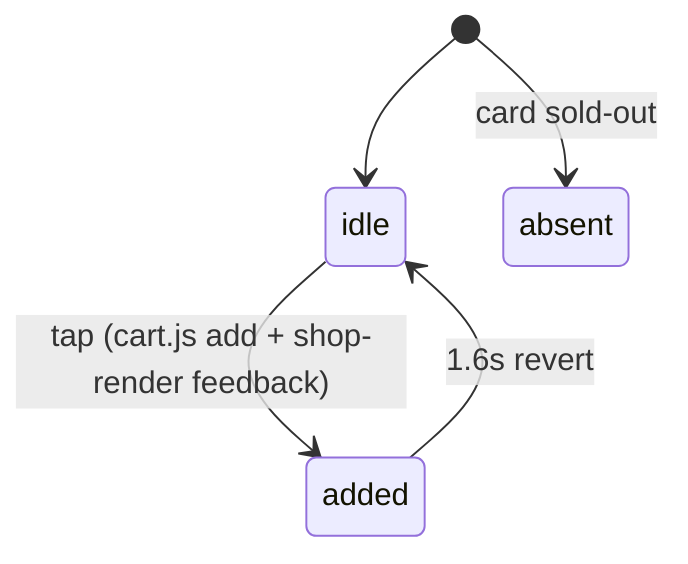
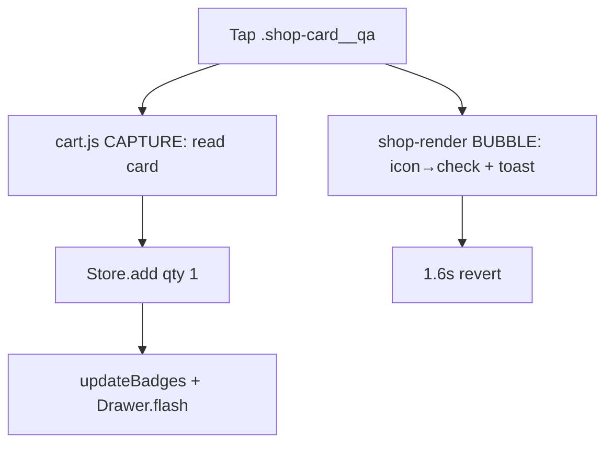

# Quick Add to Cart (PLP)

> The icon-only "add to cart" affordance in each product card's footer — added there so it stays tappable on mobile — which both flashes a mock confirmation and writes a real line to the localStorage cart.

## Human Overview

### What this feature does

- On the product-listing pages, each goods/event card carries a small **cart-icon button in the card footer** (next to the price).
- Tapping it adds that item to the cart **without opening the detail page** — a one-tap "add" from the grid.
- It gives instant feedback: the icon briefly becomes a checkmark and a toast says "「<name>」已加入購物車 · 去結帳".
- Behind the scenes the same tap is also caught by the cart module, which reads the card's data and writes a real cart line to localStorage, bumps the header cart badge, and flashes the cart drawer.
- The button was deliberately **moved out of the image frame into the footer**: the old position lived inside an `overflow:hidden` 2:3 media frame and was invisible/untappable on phones (HANDOFF "Mobile cart fix").

### Approach in one line

Render an icon-only footer button tagged `[data-add]`; `shop-render.js` gives the mock visual feedback while `cart.js`'s capture-phase document listener reads the card and performs the real `Store.add` — two listeners, one tap, no edits across modules.

### The math, in plain numbers ⚠️ READ TO VALIDATE

**No money math in quick-add itself — it's an add affordance. Price is parsed, not computed.** The load-bearing logic is the **dual-listener contract** and the **price source**:

- **Two handlers fire on one `[data-add]` tap:**
  1. `cart.js` document listener in the **CAPTURE phase** (`cart.js:222-231`) runs first, reads the card, calls `Store.add`, bumps badges, flashes the drawer. It does **not** `preventDefault`, so the event continues.
  2. `shop-render.js` grid listener in the **BUBBLE phase** (`shop-render.js:340-348`) then swaps the icon to a checkmark for 1.6s and shows the toast.
  - Capture-before-bubble is intentional so the real read happens before the icon's label mutates (`cart.js:218-221`).
- **Price source = the visible headline price**, parsed from `.shop-card__price` text with the HK$ sub-line, 兌換 chip, and pop-icon stripped (`cart.js:187-200`): `price = round(parseFloat(text-with-non-digits-removed))`, currency detected from the `NT$/HK$/$` token; **免費 / no number → 0**. The code never invents a number.
- Worked example: card "Ztor. 標準字重磅 T 恤（墨黑）" priced `NT$ 880`. Tap → `cart.js` reads `data-id=ztor-logo-heavyweight-tee-black`, `data-name`, parses `880`, currency `NT$` → `Store.add({id,title,price:880,currency:'NT$',image,qty:1})`. Header badge +1, drawer flashes, icon → ✓, toast shows. Sold-out card: no quick-add button rendered, so nothing to tap.

Source for each number in parentheses.

### Feature at a glance

| Item | Details |
| --- | --- |
| Feature ID | SHOP-005 |
| Domain | shop |
| Primary users | Guest, Fan |
| Implementation status | implemented |
| Confidence | high |
| Main routes | `shop.html`, `shop-events.html`, `shop-popcorn.html` (goods/event cards), creator pages |
| Main result | The item lands in the localStorage cart in one tap, with visible confirmation |
| Real vs mock | Real: cart write (localStorage), badge, drawer flash. Mock: the checkmark/toast feedback layer; no variant selection (defaults qty 1) |

### User-visible states

| State | Meaning | What the user sees | Available action |
| --- | --- | --- | --- |
| Idle | Default | Cart-icon button in footer | Tap |
| Added | Just tapped | Icon → checkmark (1.6s) + toast | Tap again / go to checkout |
| Absent | Card sold out | No quick-add button | Open PDP |

### Main actions

| Action | Who | When | Result |
| --- | --- | --- | --- |
| Quick-add | Guest, Fan | Non-sold-out goods/event card | Real cart line added + mock confirmation |

### Important business rules

- **Footer placement, not media overlay** — `quickAdd()` renders into `.shop-card__foot`, outside the clipped media frame (`shop-render.js:50-58, 108`).
- **Sold-out cards have no quick-add** (`:108`, `:144`).
- **Real add lives in cart.js**, keyed off `[data-add]` + the card's `data-id`/`data-name`/visible price (`cart.js:202-214`).
- **Capture-phase add** so the read precedes the label swap (`cart.js:218-221`).
- **No variant choice on PLP** — quick-add always adds qty 1 of the base id; variant selection requires the PDP ([product-detail.md](./product-detail.md)).
- The event-card quick-add uses `aria-label 購票` (kind `ticket`) but still tags `[data-add]` (`shop-render.js:54-56`).

### Related features

- [Browse Shop](./browse-shop.md) — hosts the cards
- [Product Detail Page](./product-detail.md) — the variant-aware add path
- [Shopping Cart](./shopping-cart.md) · [Checkout](./checkout.md)

### Known gaps or uncertainties

- Quick-add can't pick a variant — a tee added from the grid has no size/colour. Resolving variants needs the PDP.
- Price is **parsed from rendered text**, so it depends on the card's displayed headline being numeric; 免費 adds at 0 by design.
- Two listeners fire per tap; if either module fails to load, the other still behaves (real add without toast, or toast without add).

---

# AI and Engineering Specification

## 1. Canonical metadata

```yaml
feature:
  id: SHOP-005
  name: Quick Add to Cart (PLP)
  slug: quick-add
  domain: shop
  status: implemented
  confidence: high
  actors: [guest, fan]
  routes: [shop.html, shop-events.html, shop-popcorn.html, shop-creators.html]
  permissions: []
  featureFlags: []
  relatedFeatures: [SHOP-001, SHOP-002]
  sourceFiles:
    - assets/shop-render.js
    - assets/cart.js
    - css/components/shop-quickadd.css
  lastAuditedAt: "2026-06-25"
```

## 2. Source-code evidence

| Type | File | Symbol or line | Evidence |
| --- | --- | --- | --- |
| Render | `assets/shop-render.js` | `quickAdd` `:50-58` | Icon-only footer button `[data-add]`, kind ticket/cart |
| Render | `assets/shop-render.js` | `productCardHtml` `:108` | Quick-add appended to `.shop-card__foot` if not sold-out |
| Render | `assets/shop-render.js` | `eventCardHtml` `:144` | Event quick-add (kind 'ticket') |
| Behaviour (mock) | `assets/shop-render.js` | `wireCardActions` add branch `:340-348` | Icon→check + toast, reverts after 1.6s |
| Behaviour (real) | `assets/cart.js` | `bindAddToCart` `:217-232` | Capture-phase document listener → `Store.add` |
| Logic | `assets/cart.js` | `parsePrice` `:187-200` | Headline price parse + currency detect |
| Logic | `assets/cart.js` | `productFromCard` `:202-214` | id/name/price/image from the card |
| Side effect | `assets/cart.js` | `updateBadges` `:164-178` | Header badge bump |

## 3. Actors and permissions

| Actor | Permission or role | Allowed actions | Restricted actions |
| --- | --- | --- | --- |
| Guest | not authenticated | Quick-add (cart is local, ungated) | Checkout requires login (downstream) |
| Fan | mock logged-in | Same | — |

Quick-add itself is **ungated** — auth only gates checkout, not adding.

## 4. State model

| State ID | State name | Entry condition | Exit condition | Next states |
| --- | --- | --- | --- | --- |
| Q0 | idle | Card rendered, not sold-out | Tap | added |
| Q1 | added | Tap handled | 1.6s timeout reverts icon | idle |
| Q2 | absent | Card sold-out | — | — |



## 5. Action visibility and availability matrix

| Action ID | Label (actual copy) | UI location | Actor | Required state | Conditions | Hidden when | Disabled when | Result |
| --- | --- | --- | --- | --- | --- | --- | --- |
| A1 | 加入購物車 / 購票 (aria) | `.shop-card__qa` footer | Guest/Fan | idle | card not sold-out | card sold-out | — | Real add + mock confirm |

## 6. Functional requirements

| Requirement ID | Requirement | Evidence | Status |
| --- | --- | --- | --- |
| SHOP-005-FR-001 | The system shall render an icon-only quick-add in the card footer for non-sold-out goods/event cards | `shop-render.js:50-58,108,144` | Implemented |
| SHOP-005-FR-002 | The system shall add the card's item to the localStorage cart on tap | `cart.js:217-231` | Implemented |
| SHOP-005-FR-003 | The system shall parse the visible headline price (HK$ sub-line stripped), defaulting to 0 if non-numeric | `cart.js:187-200` | Implemented |
| SHOP-005-FR-004 | The system shall run the real add in the capture phase, before the icon label swaps | `cart.js:218-231` | Implemented |
| SHOP-005-FR-005 | The system shall show a checkmark + toast and revert after 1.6s | `shop-render.js:340-348` | Implemented |
| SHOP-005-FR-006 | The system shall bump the header cart badge and flash the drawer | `cart.js:229-230` | Implemented |
| SHOP-005-FR-007 | The system shall not render quick-add on sold-out cards | `shop-render.js:108,144` | Implemented |

## 7. User scenarios

```text
Scenario ID: SHOP-005-UC-001
Name: One-tap add from the grid
Actor: Guest
Preconditions: shop.html populated; a non-sold-out card visible
Trigger: User taps the footer cart icon
Main flow:
  1. cart.js capture listener reads the card (id, name, parsed price), Store.add(qty 1).
  2. Header badge increments and bumps; cart drawer flashes.
  3. shop-render bubble listener swaps the icon to a checkmark and toasts "「<name>」已加入購物車 · 去結帳".
  4. After 1.6s the icon reverts to the cart glyph.
Alternative flows:
  - 免費 card → added at price 0.
  - Sold-out card → no quick-add button to tap.
Error flows:
  - cart.js not loaded → only the mock toast shows, no real add.
Final state: One line (qty 1, base id) in the localStorage cart.
Related requirements: FR-002, FR-003, FR-005, FR-006
```

## 8. User-flow diagrams



## 9. Data model

The cart line written by quick-add (`cart.js:208-214`):

| Entity | Field | Type | Source | Meaning |
| --- | --- | --- | --- | --- |
| cart line | id | string | card `data-id` (or slug of title) | Line key |
| cart line | title | string | card `data-name` / title text | Display name |
| cart line | price | number | parsed `.shop-card__price` | Headline price (0 if 免費) |
| cart line | currency | string | detected token | NT$ / HK$ |
| cart line | image | string | card media `` src | Thumbnail |
| cart line | qty | number | implicit 1 (Store.add default) | Always 1 from PLP |

## 10. API and service behaviour

| Method | Function | Purpose | Request | Response | Errors | Called by |
| --- | --- | --- | --- | --- | --- | --- |
| `Store.add(product)` | cart store | Add/increment a localStorage line | product obj | mutates cart, `cart:change` | none | `bindAddToCart` `:228` |
| `updateBadges(true)` | header | Bump cart count badge | — | DOM | none | `:229` |
| `Drawer.flash(title)` | cart UI | Brief drawer/peek feedback | title | DOM | none | `:230` |
| `toast(msg, link)` | shop-render | Mock confirmation toast | msg, link | DOM | none | `shop-render.js:343` |

Real backend stub (HANDOFF): order/cart persistence replaces localStorage.

## 11. Calculations and formulas

| Calc ID | Name | Formula | Inputs | Rounding | Unit | Source |
| --- | --- | --- | --- | --- | --- | --- |
| C1 | Price parse | `round(parseFloat(text.replace(/[^\d.]/g,'')))`; 0 if none | `.shop-card__price` text | round | NT$/HK$ | `cart.js:198-199` |
| C2 | Currency detect | match `NT$|HK$|US$|$|NTD|HKD`, default NT$ | price text | — | — | `cart.js:196-197` |

## 12. Notifications and side effects

| Trigger | Recipient | Channel | Message / event | Source |
| --- | --- | --- | --- | --- |
| Quick-add | User | Toast | "「<name>」已加入購物車" + 去結帳 | `shop-render.js:343` |
| Quick-add | Cart store | localStorage + `cart:change` | `Store.add` | `cart.js:228` |
| Quick-add | Header | Badge bump | `updateBadges(true)` | `cart.js:229` |
| Quick-add | Cart UI | Drawer flash | `Drawer.flash` | `cart.js:230` |

## 13. Error and edge-case handling

| Condition | Current behaviour | User-visible result | Recovery |
| --- | --- | --- | --- |
| Sold-out card | No button rendered | Nothing to tap | Open PDP |
| 免費 / no numeric price | Added at price 0 | Free line in cart | — |
| `cart.js` not loaded | Only mock toast/check | Visual confirm, no real add | Reload |
| `shop-render` not wired | Real add still works (capture) | No checkmark/toast | — |
| Card has no `data-id` | Falls back to slug of title | Slugged id | — |

## 14. Acceptance criteria

```gherkin
Feature: Quick Add to Cart (PLP)

  Scenario: One-tap add writes a real cart line
    Given a non-sold-out product card
    When I tap its footer cart icon
    Then a cart line for that item is added with qty 1
    And the header cart badge increments
    And the icon briefly shows a checkmark with a confirmation toast

  Scenario: Sold-out card has no quick-add
    Given a sold-out card
    Then no quick-add button is rendered

  Scenario: Free item adds at zero
    Given a card priced 免費
    When I quick-add it
    Then it is added at price 0
```

## 15. Dependencies and relationships

- **Parent feature:** SHOP-001 (cards host the button).
- **Child features:** feeds SHOP "Shopping Cart" / "Checkout".
- **Shared services:** `window.ZtorCart` / internal `Store`, `Drawer`, the shop-render `toast`.
- **Shared components:** `.shop-card__qa`, `.shop-card__foot`, `.rf-toast`, `css/components/shop-quickadd.css`.
- **Events emitted / consumed:** `cart:change` (emitted via Store.add); cart drawer listens for it (`cart.js:627`).
- **Config / data dependencies:** none beyond the rendered card DOM.

## 16. Open questions and implementation gaps

### Confirmed implementation gaps

- No variant selection on quick-add (base id, qty 1 only).
- Price relies on rendered text parsing rather than the source data number.

### Conflicting implementations

- Two `[data-add]` listeners fire per tap by design (`cart.js` capture = real add; `shop-render.js` bubble = mock feedback). Documented in `cart.js:218-221`. Not a bug, but a coupling worth knowing: removing either changes behaviour.

### Unresolved questions

- Q: Should quick-add read the price from the data array instead of parsing DOM text? Why it matters: text-parse breaks if card markup changes. Files inspected: `cart.js:187-214`. Owner: frontend. Blocks-confidence? no.
