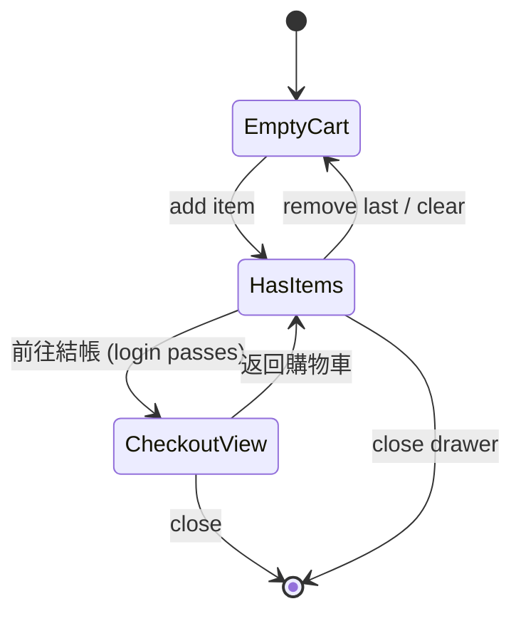
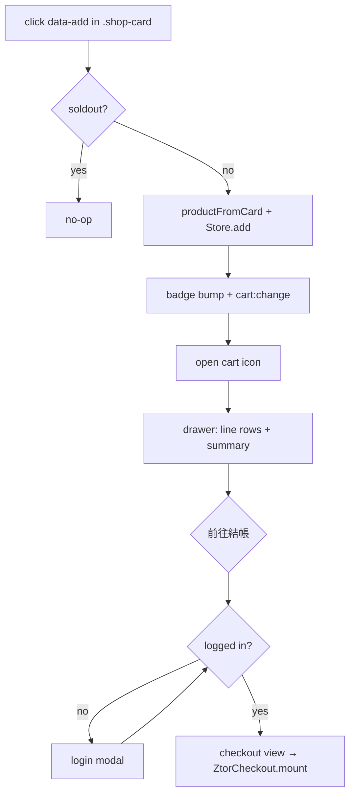

# Shopping Cart

> A localStorage-backed cart store with a right slide-over drawer — add/remove/change quantity, see line items and a live subtotal, then hand off to the multi-step checkout.

## Human Overview

### What this feature does

- Fans add shop products to a cart from product listing cards (the 加入購物車 / quick-add button) and product detail pages.
- A header cart icon (with a count badge) opens a right slide-over drawer showing every line: image, title, unit price, a −/qty/+ stepper, line total, and a remove button.
- The drawer footer shows 小計 (subtotal), 運費 (shipping), 總計 (total), and a 前往結帳 (Checkout) CTA.
- The cart survives reloads and syncs across browser tabs (localStorage).
- Pressing 前往結帳 hands off to the [Checkout](./checkout.md) stepper (after a login gate).

### Approach in one line

One self-initialising IIFE owns a localStorage-backed store (`ztor_cart_v1`) that fires `cart:change`, plus a single reusable drawer; the cart only previews shipping — the real money math lives in checkout (`assets/cart.js`).

### The math, in plain numbers ⚠️ READ TO VALIDATE

The cart store itself does only **two** arithmetic operations; the heavier tax/discount math is in [Checkout](./checkout.md).

**Constants (drawer preview only)**

- `SHIPPING_FLAT` = **NT$120** (`cart.js:25`).
- `FREE_SHIP_OVER` = **NT$3,000** (`cart.js:26`).
- `TAX_RATE` = **5%** = 0.05 — used only by the legacy inline checkout, not the cart view (`cart.js:27`).

**Formulas**

- `count` = Σ of every line's qty (`cart.js:84`).
- `subtotal` = Σ (price × qty) over all lines (`cart.js:86`).
- Drawer shipping preview `shippingFor(sub)` = `0` if `sub ≥ 3000` **or** `sub === 0`, else **120** (`cart.js:241`).
- Drawer total preview = `subtotal + shipping` (`cart.js:356`). (No tax in the cart view — tax is shown only in checkout.)

**Worked example**

> Cart: T-shirt NT$590 ×2, Poster NT$320 ×1
> - count = 2 + 1 = **3** (badge shows 3)
> - subtotal = (590×2) + (320×1) = 1180 + 320 = **NT$1,500**
> - shipping: 1500 < 3000 → **NT$120**
> - cart total preview = 1500 + 120 = **NT$1,620**

> Add 3 more T-shirts (qty 5 total) → subtotal = (590×5)+320 = 3270 ≥ 3000 → shipping **免運 (0)** → cart total **NT$3,270**.

**Edge cases**

- Empty cart (subtotal 0) → shipping shown as 免運 (0), CTA disabled (`cart.js:241,364`).
- Decreasing qty to 0 removes the line (`cart.js:103`).
- Adding an already-present item increments its qty rather than duplicating the line (`cart.js:90`).
- Items with no parseable price are stored at price 0 (`cart.js:199`); subtotal counts them as 0.

### Feature at a glance

| Item | Details |
| --- | --- |
| Feature ID | SHOP-004 |
| Domain | shop |
| Primary users | Fan (guest can build a cart; checkout needs login) |
| Implementation status | implemented |
| Confidence | high |
| Main routes | `shop.html`, `shop-item.html` (drawer injected site-wide) |
| Main result | A persisted cart + a drawer that hands off to checkout |
| Real vs mock | Real: store, drawer, persistence, cross-tab sync, all add/remove/qty logic. Mock: nothing in the cart itself; checkout/pay are mock downstream. |

### User-visible states

| State | Meaning | What the user sees | Available action |
| --- | --- | --- | --- |
| Empty | No items | 你的購物車是空的 + 回商店逛逛 | Close / shop |
| Has items | ≥1 line | Item rows + summary + 前往結帳 | Inc/dec/remove, checkout |
| Badge (closed) | Items while drawer closed | Count badge on header icon (bumps on add) | Open drawer |
| Cross-tab edit | Another tab changed the cart | Page reloads to resync | — |

### Main actions

| Action | Who | When it appears | Result |
| --- | --- | --- | --- |
| Add to cart | Fan/Guest | On `[data-add]` in a `.shop-card` | Item added, badge bumps, drawer flash |
| Open drawer | Fan/Guest | Header cart icon | Slide-over opens, focus-trapped |
| − / + (stepper) | Fan/Guest | Per line | Decrement (0 → remove) / increment qty |
| Remove (trash) | Fan/Guest | Per line | Animated leave, then line removed |
| 前往結帳 (Checkout) | Fan/Guest | Footer, when ≥1 line | Login gate → checkout stepper |

### Important business rules

- **One store, one drawer, many entry points** — `ZtorCart.openDrawer()` lets any surface open the same drawer (`cart.js:623`).
- **Soldout cards can't be added** — add is skipped on `.shop-card--soldout` (`cart.js:226`).
- **Price comes from the visible headline price** the user sees, parsed from `.shop-card__price` (secondary HK$ sub-line stripped); never invented — no number → price 0 (`cart.js:187–199`).
- **Checkout is login-gated** — see [Login Gate](../authentication/auth-gate.md) (`cart.js:500`).
- **Cross-tab safety** — a `storage` event for `ztor_cart_v1` reloads the page to resync (`cart.js:634`).

### Related features

- [Checkout (multi-step)](./checkout.md) — SHOP-006, the handoff target.
- [Login Gate](../authentication/auth-gate.md) — gates 前往結帳.
- [Mock Card Payment (ZtorPay)](../payments/mock-payment.md) — PAY-001, downstream.
- [My Orders](../orders/my-orders.md) — where a completed order lands.

### Known gaps or uncertainties

- The drawer contains a **legacy inline checkout** (`cart.js:369–486`) that is dead whenever `checkout.js` is loaded (delegation at `cart.js:373`). Real checkout = [SHOP-006](./checkout.md).
- Cross-tab sync is a full `location.reload()` (blunt but correct) (`cart.js:635`).
- Price parsing depends on the DOM markup of `.shop-card__price`; a markup change could mis-parse (`cart.js:191`).

---

# AI and Engineering Specification

## 1. Canonical metadata

```yaml
feature:
  id: SHOP-004
  name: Shopping Cart
  slug: shopping-cart
  domain: shop
  status: implemented
  confidence: high
  actors: [fan, guest]
  routes: ["shop.html", "shop-item.html"]
  permissions: []
  featureFlags: []
  relatedFeatures: ["SHOP-006", "PAY-001"]
  sourceFiles:
    - assets/cart.js
    - assets/checkout.js
  lastAuditedAt: "2026-06-25"
```

## 2. Source-code evidence

| Type | File | Symbol or line | Evidence |
| --- | --- | --- | --- |
| Service | `assets/cart.js` | `window.ZtorCart = Store` `:114` | Public store API |
| Data | `assets/cart.js` | `KEY = 'ztor_cart_v1'` `:24` | localStorage key |
| State | `assets/cart.js` | `Store` IIFE `:48–113` | items + getItems/count/subtotal/add/setQty/remove/clear |
| Calc | `assets/cart.js` | `subtotal` `:86`, `count` `:84` | Σ price×qty, Σ qty |
| Render | `assets/cart.js` | `renderCart` `:307–366` | Line rows + summary + CTA |
| Render | `assets/cart.js` | `shippingFor` `:241` | Drawer shipping preview |
| Service | `assets/cart.js` | `renderCheckout` `:369–383` | Delegates to ZtorCheckout.mount |
| Action | `assets/cart.js` | `bindAddToCart` `:217–232` | Delegated `[data-add]` capture-phase listener |
| Action | `assets/cart.js` | `parsePrice`/`productFromCard` `:187–215` | Price + product read from card DOM |
| State | `assets/cart.js` | `Drawer` IIFE `:237–609` | Open/close, focus-trap, scroll-lock, views |
| Gate | `assets/cart.js` | `[data-cart-checkout]` `:499–503` | requireLogin before checkout |
| Event | `assets/cart.js` | `emit` `:74–77`, `cart:change` listener `:627` | Persist + badge/drawer sync |
| Sync | `assets/cart.js` | `storage` listener `:634` | Cross-tab reload |

## 3. Actors and permissions

| Actor | Permission or role | Allowed actions | Restricted actions |
| --- | --- | --- | --- |
| Guest | not authenticated | Add/remove/qty, open drawer, build cart | 前往結帳 opens login modal (`cart.js:500`) |
| Fan (logged-in) | mock `body[data-auth]='logged-in'` | All cart actions + proceed to checkout | — |

## 4. State model

| State ID | State name | Entry condition | Exit condition | Next possible states |
| --- | --- | --- | --- | --- |
| C-EMPTY | empty cart | items.length === 0 | An item added | C-ITEMS |
| C-ITEMS | has items | items.length ≥ 1 | Last item removed / cleared | C-EMPTY, CO |
| D-CLOSED | drawer closed | default | open(fromEl) | D-OPEN |
| D-OPEN | drawer open | open() | close() / Esc / backdrop | D-CLOSED, CO |
| CO | checkout view | 前往結帳 + login passes | setView('cart') / close | C-ITEMS |

Default: C-EMPTY + D-CLOSED. Triggers: user (add/remove/open), payment confirmation downstream (clear), `storage` event (reload).



## 5. Action visibility and availability matrix

| Action ID | Label (actual copy) | UI location | Actor | Required state | Conditions | Hidden when | Disabled when | Result |
| --- | --- | --- | --- | --- | --- | --- | --- | --- |
| A1 | (cart icon) | Header `.header__actions` | Any | — | injected per header | — | — | Open drawer (`cart.js:148`) |
| A2 | (＋ quick-add) | `.shop-card [data-add]` | Any | — | not soldout | soldout card | soldout | Add item (`cart.js:222`) |
| A3 | − / + | Line stepper | Any | C-ITEMS | — | empty | — | setQty ±1 (`cart.js:496,497`) |
| A4 | (trash) 移除 | Line aside | Any | C-ITEMS | — | empty | — | animateRemove (`cart.js:498`) |
| A5 | 前往結帳 | Cart footer | Any | C-ITEMS | items ≥ 1 | empty | items===0 (`cart.js:364`) | Login gate → checkout (`cart.js:499`) |
| A6 | 回商店逛逛 | Empty body | Any | C-EMPTY | empty | has items | — | Close drawer (`cart.js:322`) |
| A7 | 返回購物車 | Checkout head | Any | CO | — | cart view | — | setView('cart') (`cart.js:282`) |

## 6. Functional requirements

| Requirement ID | Requirement | Evidence | Status |
| --- | --- | --- | --- |
| SHOP-004-FR-001 | The system shall persist the cart in localStorage under `ztor_cart_v1` | `cart.js:24,72` | Implemented |
| SHOP-004-FR-002 | The system shall increment qty when adding an existing item | `cart.js:90` | Implemented |
| SHOP-004-FR-003 | The system shall remove a line when its qty reaches 0 | `cart.js:103` | Implemented |
| SHOP-004-FR-004 | The system shall compute subtotal as Σ price×qty | `cart.js:86` | Implemented |
| SHOP-004-FR-005 | The system shall waive the drawer shipping preview at subtotal ≥ NT$3,000 | `cart.js:241` | Implemented |
| SHOP-004-FR-006 | The system shall show a count badge that bumps on add | `cart.js:164–177` | Implemented |
| SHOP-004-FR-007 | The system shall not add soldout products | `cart.js:226` | Implemented |
| SHOP-004-FR-008 | The system shall parse price from the visible headline price only | `cart.js:191–199` | Implemented |
| SHOP-004-FR-009 | The system shall trap focus and lock scroll while the drawer is open | `cart.js:564,585` | Implemented |
| SHOP-004-FR-010 | The system shall gate 前往結帳 behind login | `cart.js:500` | Implemented |
| SHOP-004-FR-011 | The system shall delegate the checkout view to ZtorCheckout when present | `cart.js:373` | Implemented |
| SHOP-004-FR-012 | The system shall resync across tabs on a `ztor_cart_v1` storage change | `cart.js:634` | Implemented |

## 7. User scenarios

```text
Scenario ID: SHOP-004-UC-001
Name: Add, adjust, and proceed to checkout
Actor: Fan (logged-in)
Preconditions: On shop.html, cart empty
Trigger: Press the quick-add (＋) on a product card
Main flow:
  1. Item added; header badge shows 1 and bumps
  2. Open the cart icon → drawer slides in with the line
  3. Press + twice → qty 3; subtotal recomputes; shipping preview updates
  4. Press 前往結帳 → checkout stepper opens (already logged in)
Alternative flows:
  - Press − to qty 0 → line removed; if last, empty state shown
Error flows:
  - Soldout card → add is a no-op
Final state: Checkout stepper at shipping
Related requirements: FR-002, FR-004, FR-010
```

```text
Scenario ID: SHOP-004-UC-002
Name: Cross-tab edit resync
Actor: Fan
Preconditions: Cart open in two tabs
Trigger: Remove an item in tab A
Main flow:
  1. localStorage 'ztor_cart_v1' changes
  2. Tab B receives the storage event → location.reload()
Final state: Both tabs show the same cart
Related requirements: FR-012
```

## 8. User-flow diagrams



## 9. Data model

| Entity / object | Field | Type | Required | Source | Meaning |
| --- | --- | --- | --- | --- | --- |
| cart item | id | string | yes | `cart.js:59,209` | Stable id (`data-id` or slug of title) |
| cart item | title | string | yes | `cart.js:60` | Product name |
| cart item | price | number | yes | `cart.js:61` | Unit price (parsed headline) |
| cart item | currency | string | yes | `cart.js:62` | NT$/HK$/etc., default NT$ |
| cart item | image | string | no | `cart.js:63` | Thumbnail src |
| cart item | qty | number | yes | `cart.js:64` | ≥1 |

Stored as a JSON array in `localStorage['ztor_cart_v1']`; on load it is filtered (`id` + numeric `price` required) and normalized (`cart.js:55–67`).

## 10. API and service behaviour

| Method | Function | Purpose | Request | Response | Errors | Called by |
| --- | --- | --- | --- | --- | --- | --- |
| `ZtorCart.add(p)` | `cart.js:88` | Add/increment a line | `{id,title,price,currency,image,qty?}` | — (fires cart:change) | none | `bindAddToCart` `:228` |
| `ZtorCart.setQty(id,qty)` | `cart.js:100` | Set qty (≤0 → remove) | id, qty | — | none | stepper `:496` |
| `ZtorCart.remove(id)` | `cart.js:107` | Remove a line | id | — | none | animateRemove `:530` |
| `ZtorCart.clear()` | `cart.js:111` | Empty the cart | — | — | none | checkout placeOrder |
| `ZtorCart.getItems()` | `cart.js:83` | Read (cloned) items | — | array | none | renderCart, checkout |
| `ZtorCart.subtotal()` | `cart.js:86` | Σ price×qty | — | number | none | renderCart, checkout |
| `ZtorCart.currency()` | `cart.js:87` | First line's currency | — | string | none | renderCart, checkout |
| `ZtorCart.openDrawer(el)` | `cart.js:623` | Open drawer from any surface | opener el | — | none | other surfaces |

No backend — the store IS the service. Real persistence is a backend stub (`HANDOFF.md`).

## 11. Calculations and formulas

| Calc ID | Name | Formula | Inputs | Rounding | Unit | Source |
| --- | --- | --- | --- | --- | --- | --- |
| C1 | count | `Σ item.qty` | items | none | int | `cart.js:84` |
| C2 | lineCount | `items.length` | items | none | int | `cart.js:85` |
| C3 | subtotal | `Σ item.price × item.qty` | items | none | NT$ | `cart.js:86` |
| C4 | line total | `item.price × item.qty` | price, qty | none | NT$ | `cart.js:348` |
| C5 | shipping preview | `(sub≥3000 \|\| sub===0) ? 0 : 120` | subtotal | none | NT$ | `cart.js:241` |
| C6 | cart total preview | `subtotal + shipping` | subtotal, shipping | none | NT$ | `cart.js:356` |
| C7 | parsed price | `Math.round(parseFloat(digits))` or 0 | card price text | half-up | NT$ | `cart.js:199` |

Notes: no tax in the cart view (tax appears in checkout). The legacy inline checkout (`cart.js:388`) computes `tax = round(sub × 0.05)` and total = sub + ship + tax, but that branch is dead when `checkout.js` is loaded.

## 12. Notifications and side effects

| Trigger | Recipient | Channel | Message / event | Source |
| --- | --- | --- | --- | --- |
| add/setQty/remove/clear | document | DOM event | `cart:change` `{type,id}` | `cart.js:74–77` |
| any mutation | localStorage | persistence | write `ztor_cart_v1` | `cart.js:72` |
| add | header badge | DOM | badge count + `is-bumping` | `cart.js:164–177` |
| cross-tab storage | window | reload | `location.reload()` | `cart.js:635` |

## 13. Error and edge-case handling

| Condition | Current system behaviour | User-visible result | Recovery |
| --- | --- | --- | --- |
| Corrupt localStorage | try/catch → items = [] | Empty cart | Re-add items |
| Soldout card add | no-op (`cart.js:226`) | Nothing happens | — |
| No parseable price | price stored as 0 | Line shows NT$ 0 | — |
| Drawer not yet built | renderCart guards (`cart.js:308`) | Badge still updates | Open drawer |
| prefers-reduced-motion | skips remove animation | Instant removal | — |
| Qty set to 0 / negative | routes to remove (`cart.js:103`) | Line removed | Re-add |

## 14. Acceptance criteria

```gherkin
Feature: Shopping Cart

  Scenario: Adding an existing item increments quantity
    Given a cart containing 1 of product X
    When the fan adds product X again
    Then the cart has 1 line of product X with quantity 2

  Scenario: Subtotal reflects price times quantity
    Given a cart with product priced NT$590 at quantity 2
    Then the subtotal is NT$1,180

  Scenario: Free shipping preview above threshold
    Given a cart subtotal of NT$3,000 or more
    Then the drawer shipping shows 免運

  Scenario: Decrementing to zero removes the line
    Given a cart line with quantity 1
    When the fan presses −
    Then the line is removed

  Scenario: Checkout requires login
    Given a logged-out fan with items in the cart
    When the fan presses 前往結帳
    Then the login modal appears before the checkout stepper
```

## 15. Dependencies and relationships

- **Parent feature:** none (cart is the hub).
- **Child features:** [Checkout](./checkout.md) (SHOP-006).
- **Shared services:** `window.ZtorCart` (owns), `window.ZtorAuth` (gate), `window.ZtorCheckout` (delegate).
- **Shared components:** the slide-over drawer, `shop-card` (add source), header `.header__actions`.
- **Events emitted / consumed:** emits `cart:change`; consumes `storage`, `cart:change` (self), `auth:login` (via gate resume).
- **Config / data dependencies:** `KEY`, `SHIPPING_FLAT`, `FREE_SHIP_OVER` in `cart.js`.

## 16. Open questions and implementation gaps

### Confirmed implementation gaps

- Persistence is localStorage; no backend cart API (`HANDOFF.md`).
- Cross-tab sync uses a full reload rather than a diff merge.
- Price is DOM-scraped from card markup — fragile to markup changes.

### Conflicting implementations

- The legacy inline checkout (`cart.js:369–486`) duplicates summary/payment UI and is bypassed by the `ZtorCheckout` delegation (`cart.js:373`). Authoritative checkout = [SHOP-006](./checkout.md). Recommend deleting the dead branch.

### Unresolved questions

- Q: Mixed-currency cart — `currency()` returns only the first line's currency (`cart.js:87`); subtotal sums raw numbers regardless of currency. Owner: product/frontend. Blocks confidence: no (mock data is single-currency).
- Q: Should the drawer shipping preview match checkout exactly? It uses `SHIPPING_FLAT` 120 and never reflects express or promos (preview only). Owner: frontend. Blocks confidence: no.
