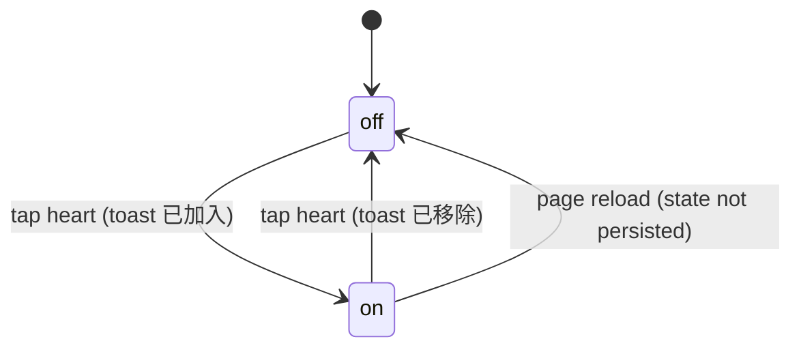
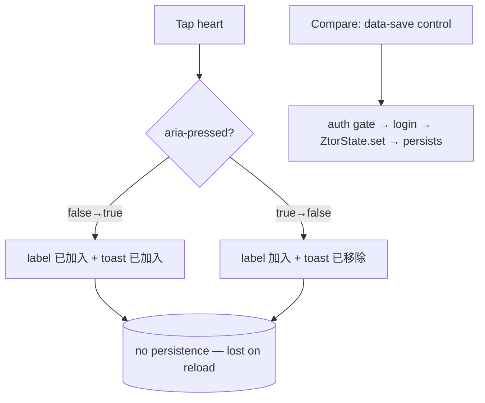

# Wishlist / Save Item

> The heart toggle on the PDP (and PLP cards) that marks an item as wanted — a local, in-session visual toggle, distinct from the site's persistent auth-gated save.

## Human Overview

### What this feature does

- A **heart button** that lets a shopper flag an item they want to come back to.
- On the **PDP** it sits in the buy column as a ghost button "加入願望清單"; tapping it flips to "已加入願望清單", presses the heart, and shows a toast. Tapping again removes it.
- On **PLP cards** the same idea appears as a small heart over the card media; toggling it presses the heart and toasts "已加入願望清單 · 查看".
- It is a **mock, in-session toggle**: the state lives only in the button's `aria-pressed` and is **not persisted** — a reload clears it. There is no wishlist page that lists saved items.
- This is intentionally **separate** from the site's real, persistent **save/收藏 gate** (`auth.js`), which requires login and writes to localStorage — that gate is wired to other controls (`[data-save]` / `[data-auth-action]`), not to these wishlist hearts.

### Approach in one line

A lightweight `aria-pressed` toggle with a toast on both PDP and PLP, deliberately decoupled from the persistent auth-gated save so browsing stays frictionless (no login wall) — at the cost of persistence.

### The math, in plain numbers ⚠️ READ TO VALIDATE

**No money math — pure UI toggle. The load-bearing logic is the toggle rule and the gating boundary.**

- **PDP toggle** (`shop-detail-render.js:510-517`): `on = aria-pressed !== 'true'` → set `aria-pressed`, swap the label between "加入願望清單" / "已加入願望清單", toast "已加入願望清單" / "已移除願望清單". No storage write.
- **PLP toggle** (`shop-render.js:333-338`): `on = aria-pressed !== 'true'` → set `aria-pressed` + `aria-label`, pop animation, toast "已加入願望清單" + 查看. No storage write.
- **Gating boundary** — the wishlist heart is **NOT** the persistent save. The persistent gate in `auth.js` only intercepts controls tagged `[data-auth-action]` / `[data-save]` / `[data-follow-toggle]` / `[data-cc-toggle]` (`auth.js:287`). The wishlist hearts use `[data-pdp-wish]` (PDP) and `[data-wish]` (PLP) — neither selector is in the gate — so:
  - Wishlist toggling **never opens the login modal** and **never persists** (no `ZtorState.set`).
  - The real save flow (`auth.js`): logged-out tap on `[data-save]` → modal → on login → toggle + `ZtorState.set('save', id, true)` → localStorage `ztor:state:save:<id>` → hydrates on reload (`auth.js:264-312`).
- Worked example: on the tee PDP, tap the heart → `aria-pressed="true"`, label "已加入願望清單", toast. Reload the page → heart resets to unpressed (nothing was stored). Compare: a `[data-save]` bookmark elsewhere survives reload via `ZtorState`.

Source for each number in parentheses.

### Feature at a glance

| Item | Details |
| --- | --- |
| Feature ID | SHOP-007 |
| Domain | shop |
| Primary users | Guest, Fan |
| Implementation status | implemented |
| Confidence | high |
| Main routes | `shop-item.html` (PDP), plus all PLP pages with cards |
| Main result | The item is visually marked as wanted for this session |
| Real vs mock | Mock: the toggle + toast (no persistence, no login gate). Real persistent save is a *separate* feature (`auth.js`), not these hearts |

### User-visible states

| State | Meaning | What the user sees | Available action |
| --- | --- | --- | --- |
| Off | Not saved | Outline heart, "加入願望清單" | Tap to add |
| On | Saved (this session) | Pressed heart, "已加入願望清單" | Tap to remove |
| (post-reload) | State lost | Reverts to Off | Re-add |

### Main actions

| Action | Who | When | Result |
| --- | --- | --- | --- |
| Toggle wishlist (PDP) | Guest, Fan | Always on a PDP | `aria-pressed` flip + label swap + toast |
| Toggle wishlist (PLP) | Guest, Fan | Any product/event/auction card | `aria-pressed` flip + pop + toast |

### Important business rules

- **No login required** — wishlist toggling is ungated (unlike persistent save).
- **No persistence** — state is DOM-only; reload clears it (`shop-detail-render.js:510-517`, `shop-render.js:333-338`).
- **Distinct from the auth save-gate** — the gate keys off `[data-save]`/`[data-auth-action]`, which the hearts don't carry (`auth.js:287`).
- **Toast feedback** confirms each toggle.

### Related features

- [Product Detail Page](./product-detail.md) — hosts the PDP heart
- [Browse Shop](./browse-shop.md) — hosts the PLP hearts
- [Authentication](../authentication/) — the persistent, login-gated save flow (`auth.js`) the wishlist is intentionally NOT wired to

### Known gaps or uncertainties

- **No persistence and no wishlist list view** — a saved item can't be retrieved later; the toggle is purely cosmetic for the session.
- The wishlist and the persistent save (收藏) are **two different mechanisms** that could confuse users — a heart that doesn't survive reload vs a bookmark that does.
- Whether the PDP heart *should* route through `auth.js`'s persistent gate is an open product decision (see Section 16).

---

# AI and Engineering Specification

## 1. Canonical metadata

```yaml
feature:
  id: SHOP-007
  name: Wishlist / Save Item
  slug: wishlist
  domain: shop
  status: implemented
  confidence: high
  actors: [guest, fan]
  routes: [shop-item.html, shop.html, shop-events.html, shop-auction.html, shop-popcorn.html]
  permissions: []
  featureFlags: []
  relatedFeatures: [SHOP-002, SHOP-001]
  sourceFiles:
    - assets/shop-detail-render.js
    - assets/shop-render.js
    - assets/auth.js
  lastAuditedAt: "2026-06-25"
```

## 2. Source-code evidence

| Type | File | Symbol or line | Evidence |
| --- | --- | --- | --- |
| Render (PDP) | `assets/shop-detail-render.js` | `goodsBuyHtml` wish button `:215-216` | `[data-pdp-wish]` ghost button + label |
| Behaviour (PDP) | `assets/shop-detail-render.js` | wish branch `:510-517` | Toggle aria-pressed + label + toast, no persist |
| Render (PLP) | `assets/shop-render.js` | `wishBtn` `:47-49` | `[data-wish]` heart over media |
| Behaviour (PLP) | `assets/shop-render.js` | wish branch `:333-338` | Toggle aria-pressed + aria-label + pop + toast |
| Boundary | `assets/auth.js` | gate selector `:287` | Persistent gate covers `[data-save]`/`[data-auth-action]` — NOT the hearts |
| Reference | `assets/auth.js` | `performAction`/`ZtorState` `:264-312` | The real persistent save path (separate) |

## 3. Actors and permissions

| Actor | Permission or role | Allowed actions | Restricted actions |
| --- | --- | --- | --- |
| Guest | not authenticated | Toggle wishlist (ungated, no persist) | — |
| Fan | mock logged-in | Same | — |

Wishlist is ungated. The persistent save (`[data-save]`) is the gated one — a different control.

## 4. State model

| State ID | State name | Entry condition | Exit condition | Next states |
| --- | --- | --- | --- | --- |
| W0 | off | Default render | Tap | on |
| W1 | on | `aria-pressed='true'` | Tap | off |
| (reset) | off | Page reload (no persistence) | — | on |



## 5. Action visibility and availability matrix

| Action ID | Label (actual copy) | UI location | Actor | Required state | Conditions | Hidden when | Disabled when | Result |
| --- | --- | --- | --- | --- | --- | --- | --- |
| A1 | 加入願望清單 / 已加入願望清單 | `.pdp-buy__wish` `[data-pdp-wish]` | Guest/Fan | any (PDP) | — | — | — | Toggle + toast |
| A2 | (heart) aria 加入願望清單 | `.rf-wish` `[data-wish]` | Guest/Fan | any (PLP card) | — | — | — | Toggle + pop + toast |

## 6. Functional requirements

| Requirement ID | Requirement | Evidence | Status |
| --- | --- | --- | --- |
| SHOP-007-FR-001 | The system shall toggle a wishlist state on the PDP via aria-pressed with a label swap and toast | `shop-detail-render.js:510-517` | Implemented |
| SHOP-007-FR-002 | The system shall toggle a wishlist heart on PLP cards with a pop animation and toast | `shop-render.js:333-338` | Implemented |
| SHOP-007-FR-003 | The system shall not require login to toggle the wishlist | `shop-detail-render.js:510-517` (no gate) | Implemented |
| SHOP-007-FR-004 | The wishlist hearts shall NOT be intercepted by the persistent auth save-gate | `auth.js:287` (selector excludes the hearts) | Implemented |

## 7. User scenarios

```text
Scenario ID: SHOP-007-UC-001
Name: Toggle wishlist on a PDP
Actor: Guest
Preconditions: shop-item.html?id=<goods> loaded
Trigger: User taps 加入願望清單
Main flow:
  1. aria-pressed flips to true; label becomes 已加入願望清單.
  2. Toast "已加入願望清單".
  3. User taps again → aria-pressed false; label 加入願望清單; toast "已移除願望清單".
Alternative flows:
  - User reloads → heart resets to off (no persistence).
Error flows: none.
Final state: Session-only wishlist mark (or cleared on reload).
Related requirements: FR-001, FR-003
```

## 8. User-flow diagrams



## 9. Data model

The wishlist has **no data model** — state is the button attribute only. For contrast, the persistent save writes:

| Entity | Field | Type | Source | Meaning |
| --- | --- | --- | --- | --- |
| wishlist (heart) | aria-pressed | "true"/"false" | DOM attribute | Session-only flag (not stored) |
| persistent save (separate) | `ztor:state:save:<id>` | {on,ts} | `auth.js` ZtorState → localStorage | The real, persisted bookmark — NOT this feature |

## 10. API and service behaviour

No service for the wishlist (DOM only). The persistent save's service (`ZtorState.set/get`, `auth.js:264-312`) is documented here only to mark the boundary — it is invoked by `[data-save]` controls, not the hearts.

| Method | Function | Purpose | Request | Response | Errors | Called by |
| --- | --- | --- | --- | --- | --- | --- |
| (none) | — | Wishlist is DOM-only | — | — | — | — |
| `ZtorState.set('save',id,on)` *(separate)* | persistent save | Persist a real bookmark | kind,id,on | Promise | rollback on reject | `auth.js performAction` (NOT the heart) |

Real backend stub (HANDOFF build 2): swap `ZtorState` get/set for `fetch()` to make persistent save server-backed. A real wishlist would need the same.

## 11. Calculations and formulas

| Calc ID | Name | Formula | Inputs | Rounding | Unit | Source |
| --- | --- | --- | --- | --- | --- | --- |
| C1 | Toggle | `on = aria-pressed !== 'true'` | current attr | — | bool | `shop-detail-render.js:512`, `shop-render.js:334` |

No other math.

## 12. Notifications and side effects

| Trigger | Recipient | Channel | Message / event | Source |
| --- | --- | --- | --- | --- |
| PDP wishlist on | User | Toast | "已加入願望清單" | `shop-detail-render.js:515` |
| PDP wishlist off | User | Toast | "已移除願望清單" | `shop-detail-render.js:515` |
| PLP wishlist on | User | Toast | "已加入願望清單" + 查看 | `shop-render.js:337` |

No storage, no events emitted (no `ledger:change` / no `ZtorState`).

## 13. Error and edge-case handling

| Condition | Current behaviour | User-visible result | Recovery |
| --- | --- | --- | --- |
| Page reload after saving | State not restored | Heart back to off | Re-tap |
| User expects a wishlist page | None exists | No list to view | (gap) |
| Confused with 收藏/save | Different control + behaviour | Heart doesn't persist; bookmark does | — |
| `DSToast` absent (PDP) | `toast()` no-ops | Silent toggle | — |

## 14. Acceptance criteria

```gherkin
Feature: Wishlist / Save Item

  Scenario: Toggle on the PDP
    Given a product detail page
    When I tap 加入願望清單
    Then the button reads 已加入願望清單 and a toast confirms it
    When I tap it again
    Then it reverts and a removal toast shows

  Scenario: No login wall
    Given I am a guest
    When I tap the wishlist heart
    Then no login modal appears

  Scenario: Not persisted
    Given I have added an item to the wishlist
    When I reload the page
    Then the heart is no longer pressed
```

## 15. Dependencies and relationships

- **Parent feature:** SHOP-002 (PDP heart) and SHOP-001 (PLP hearts).
- **Child features:** none.
- **Shared services:** `DSToast` (PDP), shop-render `toast` (PLP). No persistence service.
- **Shared components:** `.pdp-buy__wish`, `.rf-wish`, heart SVG.
- **Events emitted / consumed:** none. (The persistent save in `auth.js` is the one that uses `ZtorState`/`auth:login` — a separate control.)
- **Config / data dependencies:** none.

## 16. Open questions and implementation gaps

### Confirmed implementation gaps

- No persistence and no wishlist list view — the toggle is session-cosmetic (`shop-detail-render.js:510-517`, `shop-render.js:333-338`).

### Conflicting implementations

- **Two save mechanisms coexist:** the ungated, non-persistent wishlist heart (this feature) and the login-gated, persistent `[data-save]`/收藏 bookmark (`auth.js`). They look similar but behave differently — a likely UX confusion.

### Unresolved questions

- Q: Should the PDP/PLP wishlist hearts be re-tagged `data-auth-action="save"` so they route through the persistent gate (login + `ZtorState`) like other save controls? Why it matters: today wishlist intent is silently lost on reload. Files inspected: `shop-detail-render.js:510-517`, `shop-render.js:333-338`, `auth.js:240-312`. Owner: product/frontend. Blocks-confidence? no.
