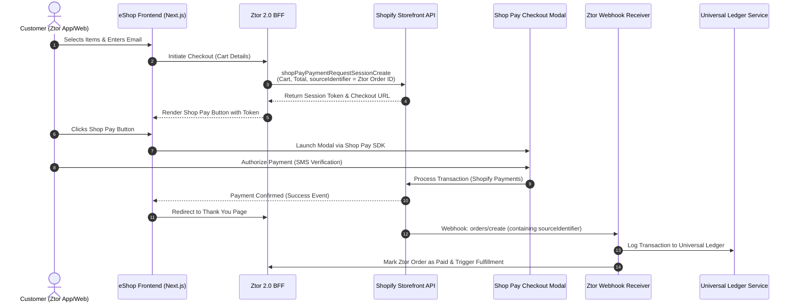

# Ztor 2.0 eShop — Shop Pay (Shop.app) Integration Technical Brief
*Status: DRAFT — needs review*
*Date: 2026-06-11*

## Executive Summary
This brief assesses the technical feasibility, architectural impact, and operational trade-offs of integrating **Shop Pay (Shop.app)** into the custom Ztor 2.0 eShop storefront.

1. **Feasibility**: Yes, integration is feasible via the **Shop Pay Wallet API** (formerly "Shop Pay on any platform"). It allows rendering the one-tap Shop Pay button on custom headless storefronts (such as Ztor's Next.js application).
2. **Core Requirement**: Shop Pay is **not** a payment method that can be toggled on or routed directly through Ztor’s existing **Stripe** gateway. It requires a dedicated, backend Shopify store with **Shopify Payments** enabled as the payment processor.
3. **Key Recommendation**: While Shop Pay offers high conversion rates in US/UK markets and mobile tracking on the Shop App, it introduces significant architectural complexity (dual-payment processors, separate payout streams, and dummy Shopify store management). We recommend evaluating **Stripe Link** (Stripe’s native accelerated checkout) as a lower-friction alternative before committing to a headless Shopify Payments setup.

---

## 1. Core Integration Architecture
To implement Shop Pay on a custom storefront without migrating the full catalog or frontend to Shopify, Ztor must implement a hybrid headless checkout flow using the **Shopify Storefront API** and the **Shop Pay Wallet JavaScript SDK**.

### Payment & Checkout Flow

### Technical Implementation Steps
1. **Shopify Store Setup**: Create a new, dedicated Shopify store (e.g., `ztor-payments.myshopify.com`) solely for processing transactions. Shopify Payments must be activated (configured for USD and HKD, which matches the currency scope in [2026-06-01-payment-gateway-stripe-2c2p-declined.md](file:///Users/ethanwalker/Workspace/ztor-docs/decisions/2026-06-01-payment-gateway-stripe-2c2p-declined.md)).
2. **Domain Registration**: Register allowed origins (e.g., `mvp.ztor.com`, `store.com`) within the Shopify admin dashboard so the SDK loads securely.
3. **Dynamic Session Creation**: When a user begins checkout, the Ztor BFF calls the Storefront API mutation `shopPayPaymentRequestSessionCreate`. 
   - **No Catalog Sync Required**: Ztor can pass cart items dynamically in the `ShopPayPaymentRequestInput` (including titles, quantities, prices, and SKUs). There is no need to pre-create these products in the Shopify catalog.
   - **Reconciliation Anchor**: Ztor must pass its internal unique checkout/order ID as the `sourceIdentifier` in the mutation.
4. **SDK Checkout Presentation**: Load the Shop Pay JS SDK, which handles the one-click modal and SMS OTP verification.
5. **Webhook Processing**: Configure a webhook listener in the Ztor BFF for Shopify's `orders/create` and `order_transactions/create` events. When Shopify successfully charges the card, the webhook payload returns the `sourceIdentifier`, allowing Ztor to reconcile the transaction and mark the internal Ztor order as paid.

---

## 2. Gateway Trade-Offs: Shop Pay vs. Stripe Link

If Ztor proceeds with Shop Pay, it will be operating a **multi-gateway setup** (Stripe for standard guest checkout + Shopify Payments for Shop Pay). Below is a comparison with using **Stripe Link** (Stripe's native one-click wallet).

| Feature / Metric | Shop Pay (via Shopify Payments) | Stripe Link (via Stripe) |
| :--- | :--- | :--- |
| **Merchant of Record** | Shopify Payments (Stripe-backed) | Stripe (Ztor's own contract) |
| **Backend Infrastructure** | Requires a dedicated Shopify store instance | None (uses existing Stripe API) |
| **Integration Complexity** | **High**: Shop Pay SDK + Storefront API + Webhook reconciliation mapping | **Low**: Enabled directly via Stripe Elements SDK |
| **Payment Flow** | Launches a Shopify-hosted modal / popup | Native inside the Stripe card element |
| **Consumer Brand Power** | **Very High** (100M+ saved profiles in US/UK; high conversion) | **Moderate** (Growing, but historically lower profile density) |
| **Consumer Experience** | Integrated with the Shop app (delivery & tracking) | One-click auto-fill, no external app integration |
| **Universal Ledger Impact** | **Complex**: Dual payout feeds (Stripe + Shopify Payments) | **Simple**: Unified payout feed under a single merchant account |
| **Currency Support** | Supports USD + HKD (HKD verified working) | Supports USD + HKD |

---

## 3. Financial & Operational Impact

### A. Universal Ledger & Payout Reconciliation
Per the Ztor 2.0 Roadmap ([ztor-beamco-2026-roadmap.md](file:///Users/ethanwalker/Workspace/ztor-docs/context/ztor-beamco-2026-roadmap.md)), the **Universal Ledger Service** (scheduled for August) acts as the cross-brand financial truth layer. 
* **Dual-PSP Feeds**: Integrating Shop Pay means the ledger must consume transaction feeds from both the Stripe API and the Shopify Payments API. 
* **Payout Timing**: Shopify Payments and Stripe process payouts on different schedules, meaning bank deposits will contain mixed payouts that must be split and reconciled programmatically.

### B. Legal and Entity Structure
Under the decided legal structure ([2026-05-18-store-holding-company-structure.md](file:///Users/ethanwalker/Workspace/ztor-docs/context/ztor-beamco-2026-roadmap.md)), Store.com acts as a holding company with sub-entities signing vendor contracts. 
* The contract for Shopify Payments will be signed by the retail/eShop sub-entity.
* The team must verify that this sub-entity holds bank accounts in a Shopify Payments-supported region (HK/US) that can accept both HKD and USD payouts.

### C. Release Sequencing
* The eShop **Public** gate and payment integration are scheduled for **August** ([2026-06-11-ztor-2-0-h2-roadmap-sequence.md](file:///Users/ethanwalker/Workspace/ztor-docs/decisions/2026-06-11-ztor-2-0-h2-roadmap-sequence.md)).
* Because the Shop Pay integration requires setting up a dedicated Shopify store, configuring webhooks, and coordinating multiple payment feeds, selecting Shop Pay will increase the developer estimate for the August payment milestone compared to Stripe Link.

---

## 4. Next Steps
If the business team decides that Shop Pay's conversion advantage is mandatory for the US market:
1. **Merchant Setup**: Establish the dedicated Shopify store and complete Shopify Payments KYC using the eShop sub-entity details.
2. **Technical Sandbox**: Kerry's team should set up a development store, register `mvp.ztor.com` as an allowed origin, and prototype the `shopPayPaymentRequestSessionCreate` mutation.
3. **Ledger Mapping**: Design the Universal Ledger schemas to accommodate both Stripe transaction IDs and Shopify transaction IDs.
