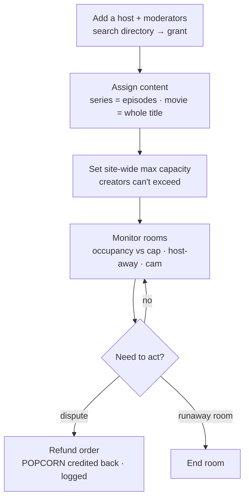
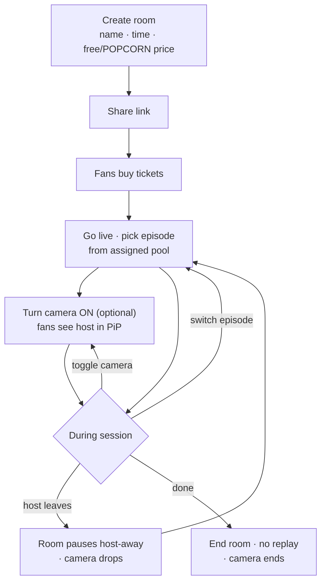
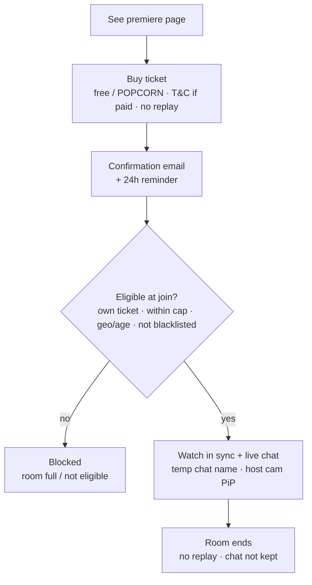

# Ztor Watch Party — Summary, User Flows & Business Requirements

> Human-facing overview for biz / ops. The other tabs hold the full, AI-buildable spec (data contract,
> gap analysis, screen states, test cases) for the dev team. · **v3 · updated 2026-06-29**

**What it is.** Synced live co-watching — a host streams a film or episode and fans watch **together in real time** with live chat. The host can also **turn their own camera on** so fans see their reactions in a small picture-in-picture tile. Launches for the **F《我要衝線》 premiere on Aug 4**.

> **New in v3 (from the 2026-06-25 discussion).** The biz team wants the **host to broadcast their camera** alongside the movie. It's a **host-only** face-cam (fans never go on camera), shown as a **picture-in-picture** tile. Technically it rides a **separate live-video layer** — the realtime sync/chat engine (Ably) is untouched and never carries the video. See decision 7 and BR-24–26.

> **Refined 2026-06-29 (IT meeting).** Capacity is a **site-wide maximum** creators can't exceed; ops can assign **moderators** (extra accounts besides the host) to a host's rooms; kicked users go on a **session blacklist**; the reminder email is **24 h before**; tickets are **bound to the buyer's account**; paid joins need a **terms checkbox**; a fan can set a **private temporary chat name** (real account stays ops-only); analytics adds an **attendance rate**. Co-host, per-creator caps, and pinned messages are **nice-to-have / later**. 2.0 design is now **frozen** for the Aug 4 launch.

**Why now.** Today there's no way for ops to control **who** hosts or **what** they stream — open self-serve hosting would leak licensed content. There's also no monitor or analytics for live rooms. This feature adds those controls.

## The 7 decisions that shaped it
*From the 2026-06-22 meetings, plus decision 7 from the 2026-06-25 discussion.*
- **Hosts are ops-granted only** — no open self-serve, no approval queue.
- Ops assigns each host a **pool of titles + episodes**; the host **picks / switches in-room** (not locked at setup — marathon-friendly).
- **Host must stay present** — they control playback, so a disconnect pauses the room until they return.
- **Capacity** — ops sets **one site-wide maximum** (~1,000); a creator picks their room's size up to that ceiling and can't exceed it (6-29; 6-28 had already dropped the advertised/server dual-number).
- **Tickets** are host-set (**free or POPCORN**) on the front end; **every ticket counts as an order**. **No replay**; **refunds credit POPCORN back to the buyer in-system** via a BO button (6-28 — never cash/Stripe).
- **Web first** for Aug 4; the in-app version (1.0 design) follows after store review.
- **🎥 Host can go on camera (new).** A **host-only** webcam feed shown to fans as a **picture-in-picture** tile — opt-in, the host toggles it on/off in-room. Envelope: host-only · up to 1,000 viewers · Hong Kong region. **Real-time tech decided 6-28: LiveKit** (WebRTC) — dev already stood up a working demo. **Ably stays sync + chat only**; the host camera rides LiveKit alongside. (AWS IVS was the long-term option but ~1+ week of env setup, so not pursued for launch.)

## User flows

### Flow A — Ops sets it up (Back office)

### Flow B — Host runs a party (Frontend, granted host)

### Flow C — Fan watches (Frontend)

## Business requirements (all BR)
Master list. Surface: **BO** = back office · **FE** = front end · **System** = enforced server-side.

| BR | Requirement | Surface |
|---|---|---|
| **Hosting & access** | | |
| BR-01 | Only ops-granted accounts can host a watch party — no open self-serve. | BO · System |
| BR-02 | Ops can add (grant) and remove (revoke) a host from any registered Ztor user. | BO |
| BR-03 | A host cannot grant themselves hosting or content — only ops writes grants. | System |
| **Content** | | |
| BR-04 | Ops assigns each host a pool of titles; a **series** grant is specific episodes, a **movie** is the whole title (no episodes). | BO |
| BR-05 | The host selects / switches the title + episode **in-room**, restricted to their grant. | FE |
| BR-06 | A host cannot stream any title or episode outside their grant. | System |
| **Room & capacity** | | |
| BR-07 | Ops sets a **site-wide maximum capacity** (~1,000); a creator sets each room's capacity up to that ceiling and can never exceed it (6-29). | BO |
| BR-08 | Admission is capped **atomically** — the room never oversells past capacity. | System |
| BR-09 | The host must stay present; on disconnect the room **pauses** (host-away) for all and resumes on reconnect. | FE · System |
| BR-10 | Ops can **end** a live room or **cancel** a scheduled one. | BO |
| **Tickets & money** | | |
| BR-11 | The host sets the ticket price (**free or POPCORN**) on the front end; price is read-only in BO. | FE · BO |
| BR-12 | A fan buys / claims a ticket and is admitted only if registered + holds a confirmed ticket. | FE |
| BR-13 | Ticket purchase is **idempotent** — a double-tap or retry charges once. | System |
| BR-14 | A BO **refund button** marks an order refunded and **credits the ticket's POPCORN back to the buyer in-system** (never cash/Stripe); audited. | BO |
| BR-15 | Every watch-party ticket is an **Order** counted toward the title's total order count. | System |
| BR-16 | **Rev-share / commission split is a future phase** (tracked, not computed in v1). | Future |
| **Playback & chat** | | |
| BR-17 | Viewer playback is **host-synced** (play / pause / seek + late-join snapshot). | FE |
| BR-18 | **No replay** — the ticket covers the live session only; stated to fans before purchase. | FE |
| BR-19 | Live chat + presence during the room; **chat is not retained** after the room ends. | FE |
| **Comms & reporting** | | |
| BR-20 | Confirmation **emails** on party creation (host), ticket purchase (buyer), and a **reminder 24 h before** start (6-29). | System |
| BR-21 | **Analytics**: watch-party orders, attendees, **attendance rate** (attended ÷ sold), chat activity, avg watch time, with export. Deeper reports / revenue tiering land in August. | BO |
| BR-22 | Every ops action (grant / assign / capacity / moderator / end / cancel / refund) writes an **audit** entry. | BO · System |
| **Trust & safety** | | |
| BR-23 | **Geoblocked / age-restricted** titles are enforced at playback; the geoblock notice shows on the movie page **and at the watch-party entry** even if a link is shared around (6-29). | System |
| **Roles, access & moderation (6-29)** | | |
| BR-27 | Ops can assign **moderators** — extra accounts (besides the host) who may enter a host's rooms to **manage chat and kick** users. FE self-serve assignment is a later phase. | BO |
| BR-28 | A kicked user is added to the room's **session blacklist** and can't rejoin that session; the host or ops can lift it. A **site-wide** blacklist is a later phase. | FE · BO |
| BR-29 | A watch-party ticket is **bound to the buyer's account** — it can't be shared with a non-paying friend. | FE · System |
| BR-30 | Before a **paid** join, the fan must accept a **terms & conditions** checkbox. | FE |
| BR-31 | A fan can set a **temporary chat name** for a room — what other viewers see, keeping their real account private. The system **stores the chat-name → account mapping** (ops-only in the BO) so a user can be **traced** if needed. | FE · BO · System |
| **Host camera (live broadcast)** | | |
| BR-24 | The host can broadcast their **own camera** (host-only) alongside the movie; fans see it as a **picture-in-picture** tile. It is **opt-in** — off by default, the host toggles it on/off **in-room**. | FE |
| BR-25 | The camera is a **separate live stream** (**LiveKit**, real-time WebRTC), **not** carried by the sync bus and independent of the movie's playback sync; it is **not recorded or replayed**. Viewers' PiP appears/disappears on the host's on/off signal. | FE · System |
| BR-26 | Ops can **disable** the host camera per party and see a **camera-live** indicator in the monitor; **End room** stops the camera with the room, and on **host-away / ended** the camera drops automatically. | BO · System |

> Each BR maps to the detailed, testable requirements in the **Back Office** and **Frontend** tabs (their `FR-##` + the gap-engine resolutions in **Feature spine**).

## Email notifications
Three system emails. Full **bilingual (EN + 繁中)** copy, placeholder tokens, and content-team questions live in the **Email templates** tab — short EN versions below.

| Email | Trigger | To |
|---|---|---|
| Party created | host creates a party | Host |
| Ticket purchased | fan buys / claims a ticket | Buyer |
| Party reminder | **24 h before** start | Ticket holders |

**1 · Party created → Host** — *Subject: Your watch party "{{partyName}}" is set*
> Hi {{hostName}}, your watch party is ready. **{{partyName}}** · Starts **{{startTimeLocal}}** · Ticket **{{ticketPrice}}**. Share this link so ticketed fans can join: **{{joinLink}}** (code {{roomCode}}). Open the room at start and pick the episode — you control playback, so please stay for the whole session.

**2 · Ticket purchased → Buyer** — *Subject: You're in — ticket for "{{partyName}}"*
> Hi {{buyerName}}, your ticket is confirmed. **{{partyName}}** — {{titleName}} · Starts **{{startTimeLocal}}** · Paid **{{ticketPrice}}**. Join: **{{joinLink}}**. Please note — this is a live session with **no replay**, so join at the start time. Can't make it? Contact support.

**3 · Party reminder (24 h before) → Ticket holders** — *Subject: Tomorrow: your watch party "{{partyName}}"*
> Hi {{buyerName}}, your 24-hour reminder — **{{partyName}}** starts **{{startTimeLocal}}**. Join when it goes live: **{{joinLink}}**. It's live only, no replay. Grab your popcorn 🍿

## Scope
- **In:** everything above — including the **host camera** (host-only, PiP, on LiveKit) and **moderators**.
- **Nice-to-have / later (6-29):** **co-host** (multiple hosts) · **per-creator** capacity limits · **pinned message** · **site-wide blacklist** · a **price-approval** review step (creator sets the price now).
- **Out (v1):** rev-share split · marketing tooling (SMS / blasts) · automatic (cash/Stripe) refunds · **viewer cameras** (fans on cam) · **camera recording / replay** (LiveKit recording costs extra — staff screen-record promo instead) · two-way voice chat · subscriber-vs-new analytics (no subscription product).

## Open decision (needs an owner)
- **How watch-party revenue splits** (platform / tastemaker / creator / backer) → **future phase. Owner: Susan (Finance).** Stats are tracked now; the split isn't computed yet. Doesn't block launch.

## Key dates
- **End of July** — internal test build.
- **Aug 4** — F《我要衝線》 promo launch (web).

## Try it
- **Back office:** https://ztor-watchparty.vercel.app/bo
- **Watch-party site:** https://ztor-watchparty.vercel.app
- **Solution diagram:** https://ztor-watchparty.vercel.app/solution-architecture.html
