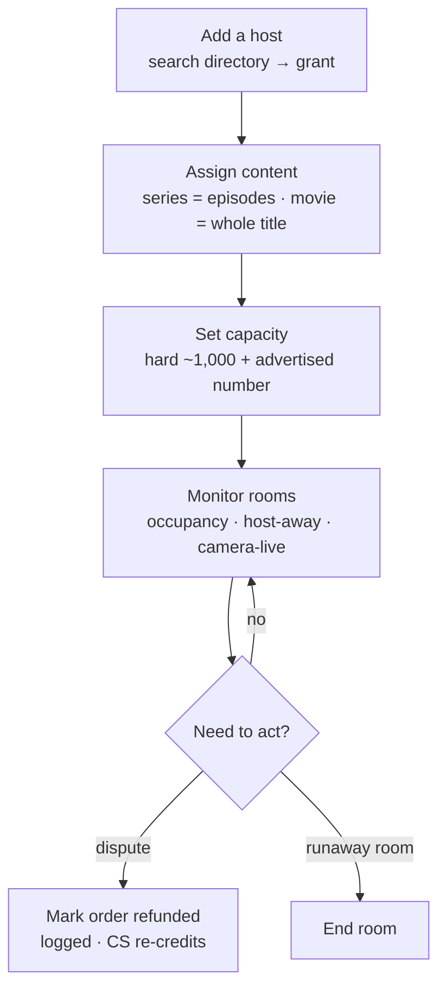
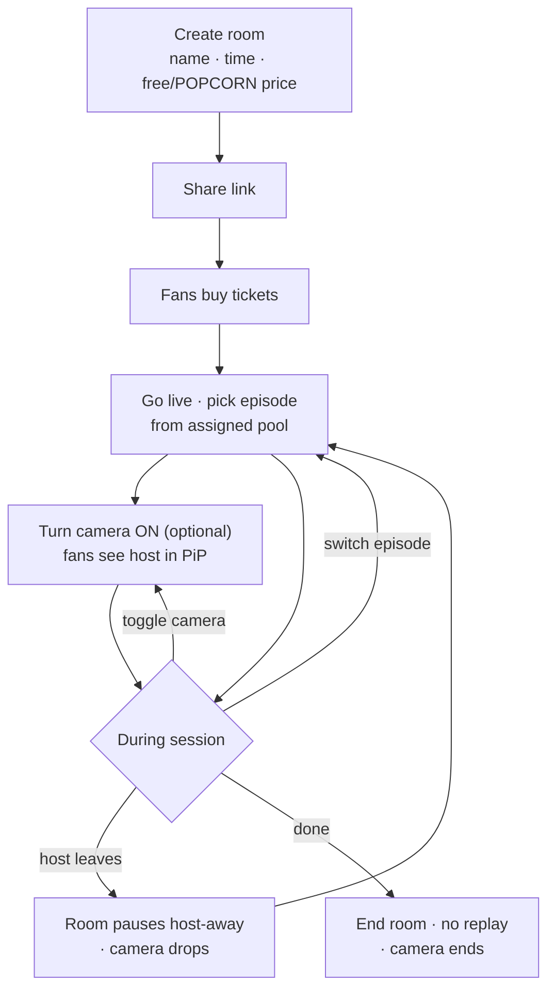
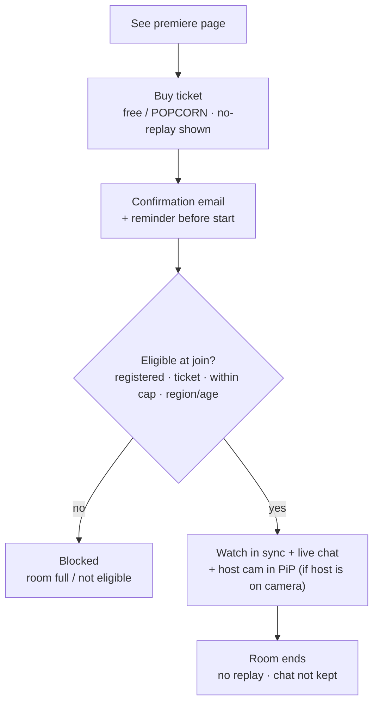

# Ztor Watch Party — Business Overview

> For the **business team**. Just the user flows and what the product does. The full technical spec (data model, edge cases, test cases) lives in the dev BRD. · **v3 · 2026-06-26**

**What it is.** Synced live co-watching — a host streams a film or episode and fans watch **together in real time** with live chat. The host can also **turn their own camera on** so fans see their reactions in a small picture-in-picture tile. Launches for the **F《我要衝線》 premiere on Aug 4**.

**Why it matters.** Today there's no way to control **who** may host or **what** they stream — open hosting would leak licensed content. This adds those controls, plus a live monitor and analytics, and turns every watch-party ticket into a counted order.

## User flows

### Flow A — Ops sets it up (Back office)

### Flow B — Host runs a party

### Flow C — Fan watches

## What the product does
Plain-language requirement list. **Who** = the side that experiences it: **Ops** (back office) · **Host** · **Fan** · **Automatic** (the system handles it).

| # | Requirement | Who |
|---|---|---|
| **Hosting & access** | | |
| BR-01 | Only accounts ops have granted can host a watch party — no open self-serve. | Ops |
| BR-02 | Ops can grant or remove the host role for any registered Ztor user. | Ops |
| BR-03 | A host can never give themselves hosting rights or content — only ops can. | Automatic |
| **Content** | | |
| BR-04 | Ops gives each host a set of titles they may stream — for a series it's specific episodes; a movie is the whole title. | Ops |
| BR-05 | The host picks and switches the title/episode **live in the room**, limited to what they were given. | Host |
| BR-06 | A host can't stream anything outside what ops assigned. | Automatic |
| **Room & capacity** | | |
| BR-07 | Each room has a real cap (~1,000) plus a separate, lower **advertised** number for marketing. | Ops |
| BR-08 | A room never oversells — admission stops exactly at capacity. | Automatic |
| BR-09 | The host must stay present; if they drop, the room **pauses** for everyone and resumes when they're back. | Host |
| BR-10 | Ops can **end** a live room or **cancel** a scheduled one. | Ops |
| **Tickets & money** | | |
| BR-11 | The host sets the ticket price (**free or POPCORN**) when creating the party. | Host |
| BR-12 | A fan can join only if they're registered and hold a valid ticket. | Fan |
| BR-13 | A double-tap on Pay only charges **once**. | Automatic |
| BR-14 | **No automatic refunds** — ops marks an order refunded (logged), and CS re-credits POPCORN manually. | Ops |
| BR-15 | Every watch-party ticket counts as an **order** toward the title's total. | Automatic |
| BR-16 | **Revenue share / commission split is a future phase** — stats are tracked now, the split isn't computed yet. | Future |
| **Watching** | | |
| BR-17 | Everyone's playback stays **in sync** with the host. | Fan |
| BR-18 | **No replay** — the ticket is for the live session only (stated before purchase). | Fan |
| BR-19 | Live chat + "who's watching" during the room; chat is **not kept** after it ends. | Fan |
| **Host camera** | | |
| BR-24 | The host can turn on their **own camera** (host-only); fans see it as a **picture-in-picture** tile. It's optional — off by default, the host toggles it. | Host |
| BR-25 | The camera is a **separate live feed**, not recorded or replayed; fans' PiP appears/disappears when the host toggles it. | Host |
| BR-26 | Ops can **disable** the camera for a party and see a **camera-live** indicator while monitoring; ending the room stops the camera too. | Ops |
| **Comms, reporting & safety** | | |
| BR-20 | Automatic **emails**: party created (host), ticket purchased (buyer), and a start reminder. | Automatic |
| BR-21 | **Analytics**: watch-party orders, attendees, chat activity, average watch time — with export. | Ops |
| BR-22 | Every ops action (grant, assign, capacity, end, refund) is **logged** for the record. | Ops |
| BR-23 | **Geoblocked / age-restricted** titles are enforced — ineligible viewers are blocked. | Automatic |

## Email notifications
Three automatic emails. Short English copy below; the full **bilingual (EN + 繁中)** versions with all placeholder tokens are in the dev BRD's email-templates tab (heading to the content team).

| Email | When it's sent | To |
|---|---|---|
| Party created | the host creates a party | Host |
| Ticket purchased | a fan buys / claims a ticket | Buyer |
| Starting soon | shortly before start | Ticket holders |

**1 · Party created → Host** — *Subject: Your watch party "{{partyName}}" is set*
> Hi {{hostName}}, your watch party is ready. **{{partyName}}** · Starts **{{startTimeLocal}}** · Ticket **{{ticketPrice}}**. Share this link so ticketed fans can join: **{{joinLink}}** (code {{roomCode}}). Open the room at start and pick the episode — you control playback, so please stay for the whole session.

**2 · Ticket purchased → Buyer** — *Subject: You're in — ticket for "{{partyName}}"*
> Hi {{buyerName}}, your ticket is confirmed. **{{partyName}}** — {{titleName}} · Starts **{{startTimeLocal}}** · Paid **{{ticketPrice}}**. Join: **{{joinLink}}**. Please note — this is a live session with **no replay**, so join at the start time. Can't make it? Contact support (refunds are manual).

**3 · Starting soon → Ticket holders** — *Subject: Starting soon: "{{partyName}}"*
> Hi {{buyerName}}, **{{partyName}}** starts at **{{startTimeLocal}}** — soon! Join when it goes live: **{{joinLink}}**. It's live only, no replay. Grab your popcorn 🍿

## See it
- **Watch-party site:** https://ztor-watchparty.vercel.app
- **Back office:** https://ztor-watchparty.vercel.app/bo
- **Full dev BRD:** https://ztor-watchparty.vercel.app/brd
